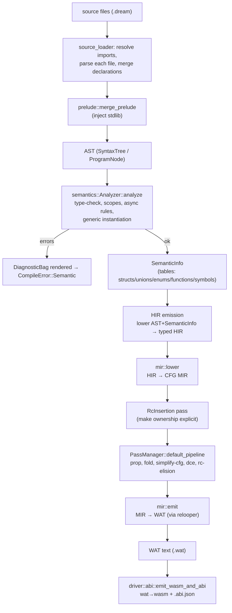
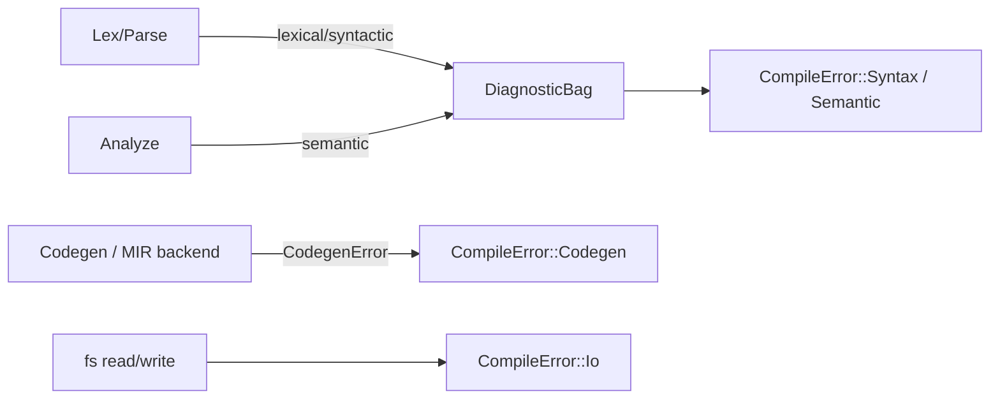

# 01 — Pipeline Overview

This document walks the whole compilation pipeline stage by stage: what each stage consumes, what it
produces, where it lives, and what invariants it guarantees for the next stage. Treat it as the map;
the later documents zoom into individual regions.

## The end-to-end flow

The `hir → mir → emit` pipeline is the **only** backend. (The legacy AST-walking `WasmGenerator` has
been deleted; see the migration document.)

## Stage-by-stage

### 1. Source loading — `src/driver/source_loader.rs`, `src/driver/prelude.rs`

- **In:** an entry file path.
- **Out:** one merged `ProgramNode` (all imported files' declarations + the prelude).
- **Key types:** `ProgramAccumulator` collects `all_functions`, `all_structs`, `all_enums`,
  `all_extends`, `all_globals`, and `visited` (cycle guard).
- **Guarantees:** import cycles are broken; every referenced module is parsed once.

### 2. Lexing & parsing — `crates/dream-syntax/`

- **In:** source text.
- **Out:** the AST. Entry points: `Lexer::new`, `Parser::new(...).parse()`.
- **AST shape:** `ProgramNode` → declarations (`FunctionNode`, `StructDeclarationNode`,
  `EnumDeclarationNode`, …); bodies are `StatementNode`s and `ExpressionNode`s; type annotations are
  the `Type` enum (`crates/dream-syntax/src/nodes/types.rs`).
- **Guarantees:** lexical/syntactic errors are reported into a `DiagnosticBag`. The AST is *faithful*
  to source — no desugaring beyond what the parser does for `for-each` index locals.

### 3. Semantic analysis — `src/semantics/analyzer/`

- **In:** the AST.
- **Out:** `SemanticInfo` (the analysis result) or a `CompileError::Semantic` after errors.
- **What it does:** name resolution, type checking, scope validation, `async`/`await` legality,
  overload selection, and **generic instantiation** (monomorphization discovery).
- **Tables it populates** (in `SemanticInfo`):
  - `StructTable` / `StructInfo` — field layout (`src/semantics/struct_table.rs`)
  - `UnionTable` / `UnionInfo` — variant layout (`src/semantics/union_table.rs`)
  - `EnumTable` — `name → (member → i32)` (`src/semantics/analyzer/mod.rs`)
  - `FunctionTable` / `FunctionTableInfo` — signatures + overloads (`src/semantics/function_table.rs`)
  - symbol tables — per-scope `name → Type` (`src/semantics/symbol_table.rs`)
- **Today's smell:** these tables key and compare types as **strings** (`get_type()`), and the
  instantiation map is keyed by mangled names. Phase 1 replaces that with `TypeId`/`DefId`.

### 4. Type system — `src/types/` (cross-cutting)

Not a pipeline "stage" so much as the shared vocabulary used by stages 3–7. See
[02-type-system.md](./02-type-system.md). The `TypeCtx` (interner + def table + lowering) is the
object threaded through analysis and lowering.

### 5. HIR emission — `src/hir/` (analyzer-side; TARGET)

- **In:** AST + the facts the analyzer computed.
- **Out:** `Hir` — typed, name-resolved (see [03-hir.md](./03-hir.md)).
- **Why:** persist what `analyze_expression`/overload selection currently *discard* so codegen never
  re-derives. Once this exists, `codegen/wasm/utils/infer.rs` and `resolve.rs` are deleted.

### 6. MIR lowering & optimization — `src/mir/`

- **In:** HIR.
- **Out:** optimized MIR (a CFG per function).
- **Steps:** `mir::lower` desugars structured control flow into blocks; `RcInsertion` makes ownership
  explicit; `PassManager` runs the optimization pipeline to a fixpoint. See
  [04-mir.md](./04-mir.md) and [05-writing-passes.md](./05-writing-passes.md).

### 7. Backend — `src/mir/relooper.rs` + `src/mir/emit.rs`

- **In:** optimized MIR.
- **Out:** WAT text.
- **How:** the relooper recovers structured shapes from the CFG; `emit` walks the function and emits
  WAT, reusing the runtime/memory/object/string layers. See
  [06-relooper-and-backend.md](./06-relooper-and-backend.md).

### 8. Assembly emission — `src/driver/abi.rs`

- **In:** WAT text + the AST root (for ABI metadata).
- **Out:** `.wat`, `.wasm`, and an `.abi.json` describing extern imports/exports for the JS runtime.

## Where errors come from

- User-facing problems are reported as **diagnostics** during lex/parse/analyze and surface as
  `CompileError::Syntax` / `CompileError::Semantic`.
- The backend returns a typed `CodegenError` (`src/codegen/mod.rs`):
  - `Unsupported` — a valid construct the backend cannot yet emit (user-actionable).
  - `Internal` — an invariant the analyzer should have guaranteed (a compiler bug / ICE).
  - `UnknownSymbol` / `UnknownType` / `UnknownDef` — resolution failures that should not happen post-analysis.
- Codegen never runs on a program that produced any diagnostic error, so `Error`-typed (poison)
  values never reach lowering.

## Invariants the back end relies on

1. **Analysis succeeded.** No poison types, every name resolved, every call has a callee.
2. **Types are interned.** Equality is `TypeId == TypeId`; no string parsing of type names.
3. **Generics are resolved.** Every generic use is recorded as a concrete `(DefId, args)` instance.
4. **Control flow is reducible.** Dream's surface syntax cannot express irreducible CFGs, so the
   relooper always succeeds.
5. **Determinism.** Every map that influences emission preserves insertion order (`IndexMap`), so two
   compilations of the same input produce byte-identical output (guarded by the `codegen_is_deterministic`
   e2e test).
