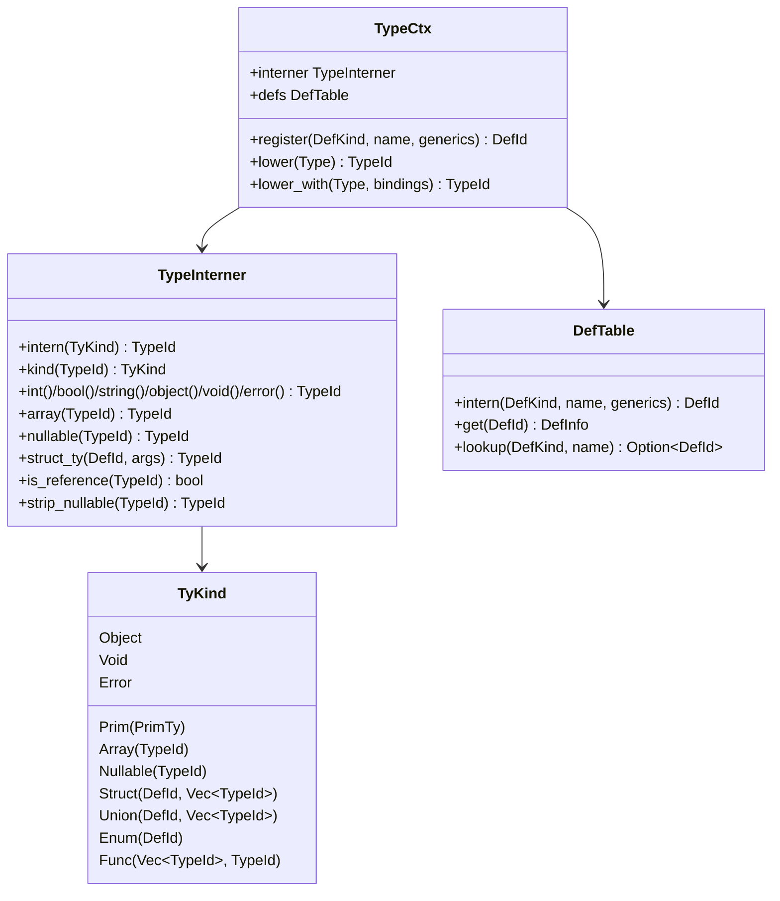

# 02 — The Structured Type System (`src/types/`)

This is the foundation everything else builds on. Read it before HIR/MIR.

## The problem it replaces

Historically a type was identified by the string `Type::get_type()` produces:

| Type | Legacy string | Problems |
|------|--------------|----------|
| `int[]` | `"int[]"` | every consumer re-parses the `[]` suffix |
| `int?` | `"int?"` | nullable handled by `strip_suffix('?')` everywhere |
| `Box<int>` | `"Box_int"` | mangling; `demangle_generic_struct` heuristically splits on `_` |
| `Pair<int,string>` | `"Pair_int_string"` | ambiguous if a base name contains `_` |
| `fun(int):bool` | `"fun(int):bool"` | parsed by string surgery |

Equality was a `String` compare; monomorphization was string mangling; reference-ness was
`ends_with("[]") || known_struct(name)`. The structured system turns all of this into integer
operations.

## The pieces



### `TypeId` and `TyKind` — `src/types/kind.rs`, `src/types/mod.rs`

`TypeId(u32)` is an interned handle. `TyKind` is the *shape* of a type. Crucially, `TyKind` is flat:
nested types are referenced by `TypeId`, not owned, so a `TyKind` is cheap to clone, hash, and
compare — which is what makes interning possible.

```rust
pub enum TyKind {
    Prim(PrimTy),                  // int, uint, long, ulong, byte, float, double, bool, char, string
    Object,                        // the universal top type
    Void,
    Error,                         // poison
    Array(TypeId),
    Nullable(TypeId),
    Struct(DefId, Vec<TypeId>),    // (definition, type arguments)
    Union(DefId, Vec<TypeId>),
    Enum(DefId),
    Func(Vec<TypeId>, TypeId),     // (params, return)
}
```

`PrimTy` keeps `string` for naming convenience; whether a value is a heap reference is decided by
`TyKind::is_reference` / `TypeInterner::is_reference`, not by `PrimTy`.

### `TypeInterner` — `src/types/interner.rs`

Hash-conses `TyKind → TypeId`. The nullary types (all primitives, `Object`, `Void`, `Error`) are
pre-interned in `new()` so their ids are stable and reachable via accessors (`int()`, `bool()`, …).

Two design rules worth knowing:
- `nullable(nullable(t))` collapses to `nullable(t)` — `T??` is `T?`.
- `is_reference(id)` strips a `Nullable` wrapper first, so `string?` is a reference.

> **Equality is `==`.** Because identical `TyKind`s always intern to the same `TypeId`, you never
> compare type *shapes* — you compare ids. If you find yourself matching on `TyKind` to test equality,
> you almost certainly want `id_a == id_b`.

### `DefId` and `DefTable` — `src/types/def.rs`

A `DefId` names a nominal declaration: a struct, union, enum, or function (`DefKind`). It is
**independent of type arguments** — `Box<int>` and `Box<string>` are `Struct(box_def, [int])` and
`Struct(box_def, [string])` with the *same* `box_def`. `DefInfo` records the base `name` (never
mangled) and the declared `generic_params` (`["T"]`).

This is the key to monomorphization: instead of inventing the string `"Box_int"`, you key instances
by `(DefId, Vec<TypeId>)`. The emitted WASM symbol name is generated only at the backend from that
pair.

### Compatibility & widening — `src/types/compat.rs`

Three structural relations replace the old string comparisons:

- `numeric_widen(from, to)` — the implicit numeric widening lattice
  (`byte → int → long → float → double`, plus unsigned/float cross-edges). `from == to` is *false*
  (identity is handled separately).
- `assignable(interner, target, value)` — may `value` be assigned to `target`? Encodes: `Error`
  poison is bidirectional; anything widens into `object`; enums interconvert with `int`; numerics
  widen per the lattice; a nullable target accepts the bare inner type or the `null` literal (`void?`).
- `overload_compatible(interner, param, arg)` — *looser* than `assignable`: any two numeric primitives
  are compatible regardless of direction (exactness is scored separately during overload ranking).

> The `null` literal is modeled as `Nullable(Void)` (i.e. `void?`).

### Display — `src/types/display.rs`

`display_name(interner, defs, id)` renders source-level syntax for diagnostics and the LSP:
`int[]`, `string?`, `Box<int>`, `fun(int): bool`. Generics use angle brackets, **never** the internal
`Box_int` spelling. The LSP tests depend on this (`Box<int>`).

### `TypeCtx` — `src/types/lower.rs`

The analyzer-facing bundle: it owns the `TypeInterner` and `DefTable` and lowers AST `Type` → `TypeId`.

- `register(kind, name, generics)` records a nominal def (call this when you see a declaration).
- `lower(&Type)` lowers a type annotation with no generics in scope.
- `lower_with(&Type, &bindings)` lowers with generic parameter substitution (`bindings: name → TypeId`),
  used when instantiating a generic body.

Because the parser emits `Type::Struct` for *any* bare identifier (structs, unions, and enums look
identical syntactically), `TypeCtx` keeps a `nominal: name → DefKind` registry so `lower` can pick
`Struct`/`Union`/`Enum`. Register declarations before lowering their uses.

## How to add a new type to the language

Worked example: adding a 128-bit integer `i128`.

1. **Lexer/parser/AST** (`crates/dream-syntax`): add the keyword and a `Type::I128(SyntaxToken)`
   variant; update `Type::get_type()` and `Type::from_token()`. (`get_type()` is still used by the
   analyzer's string-keyed tables.)
2. **`PrimTy`** (`src/types/kind.rs`): add `PrimTy::I128`, plus its `name()`, `from_name()`,
   `is_numeric()`, `is_unsigned_integer()` arms.
3. **Interner** (`src/types/interner.rs`): pre-intern it in `new()` (add to the `for prim in [...]`
   list) so it has a stable id.
4. **Widening** (`src/types/compat.rs`): add the lattice edges in `numeric_widen`.
5. **Lowering** (`src/types/lower.rs`): add the `Type::I128(_) => self.interner.prim(PrimTy::I128)`
   arm.
6. **Backend** (`src/mir/emit.rs`): map it to a WASM type in `wasm_ty` and choose instructions in
   `binop_instr` (likely an `i64` pair or a runtime helper).
7. **Tests**: add a `types::tests` case and an e2e fixture.

Notice that **type identity, equality, and display fall out for free** once the `PrimTy` arm exists —
that is the entire point of the structured representation.

## Common pitfalls

- **Don't compare types by `display_name`.** Display is lossy/for-humans. Use `TypeId == TypeId`.
- **Register defs before lowering their uses**, or `lower` will default an unknown nominal name to a
  struct.
- **Reference-ness goes through the interner** (`is_reference`), which strips nullability. Don't
  re-implement it with string suffix checks.
- **Monomorphization keys are `(DefId, Vec<TypeId>)`**. Never reintroduce mangled-string keys.
