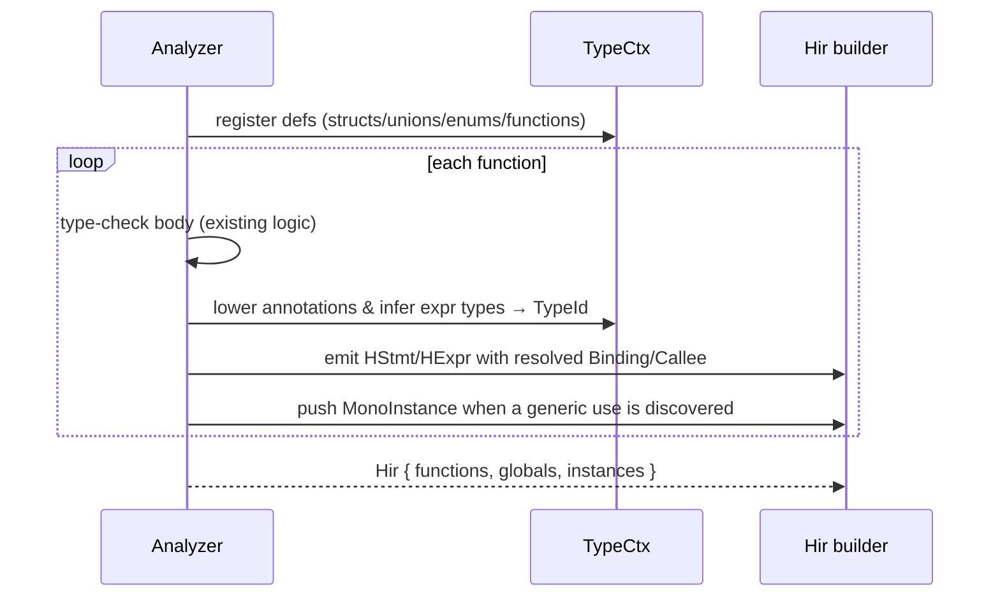

# 03 — Typed HIR (`src/hir/`)

The HIR is the AST **after type-checking and name resolution**. Its single job is to *persist
everything the analyzer learned* so that nothing downstream has to re-derive it. If you ever find the
backend "figuring out" a type or which function a call refers to, that fact belongs in HIR instead.

## What HIR adds over the AST

```mermaid
flowchart LR
    subgraph AST
      a1["Identifier \"x\""]
      a2["Call \"foo\"(args)"]
      a3["BinaryExpr a + b\n(no type)"]
    end
    subgraph HIR
      h1["Var(Binding::Local(3))"]
      h2["Call{callee: Callee{def, instance, ret}}"]
      h3["HExpr{ty: int, Binary{Add, ..}}"]
    end
    a1 --> h1
    a2 --> h2
    a3 --> h3
```

Three resolutions happen at the AST→HIR boundary:

1. **Every expression gets a `TypeId`.** `HExpr { ty, kind }` — `ty` is the interned result type.
2. **Every name becomes a `Binding`.** `Local(LocalId)`, `Global(GlobalId)`, or `Func(Callee)`. No
   more string lookups in symbol tables downstream.
3. **Every call names a `Callee`.** `{ def, instance, ret }` — which definition, which monomorphized
   instance (if generic), and the concrete return type at *this* call site.

Control flow is still **structured** (`if`/`while`/`for`/`foreach`/`switch`). Flattening into a CFG is
MIR's job, not HIR's — keeping it structured here makes HIR easy to produce from the analyzer and easy
to read.

## The top-level container

`Hir` (`src/hir/mod.rs`) holds three lists:

```rust
pub struct Hir {
    pub functions: Vec<HFunction>,   // non-generic + already-monomorphized bodies, in emission order
    pub globals:   Vec<HGlobal>,
    pub instances: Vec<MonoInstance>, // the monomorphization worklist
}
```

`MonoInstance { def: DefId, args: Vec<TypeId> }` is the entire monomorphization story: a list of
concrete `(generic def, type args)` pairs the backend must emit. No mangled names, no string parsing —
the emitted WASM symbol is derived from the pair at the very end.

## Functions, params, locals

`HFunction` carries `def` (its `DefId`), the base `name`, the `instance` args (empty unless this is a
monomorphized copy), typed `params`, the `ret` type, a `locals` table, the structured `body`, and
`is_async`.

`LocalId(u32)` indexes locals uniquely within a function; parameters are just the first locals.
`HLocal`/`HParam` record the declared `ty` so MIR's `RcInsertion` knows which locals are references and
the backend knows how to allocate slots.

## Statements — `HStmt`

| Variant | Meaning |
|---------|---------|
| `Let { local, ty, value }` | typed binding |
| `Assign { place, value }` | store to an `HPlace` |
| `Expr(HExpr)` | evaluate for effect |
| `Return(Option<HExpr>)` | |
| `If / While / For / Foreach` | structured control flow (typed parts) |
| `Switch { scrutinee, arms, default }` | `switch`/`match`; arms are `HArm { pattern, body }` |
| `Break / Continue (Option<label>)` | |
| `Await(HExpr)` | the only legal `await` *statement* position |

`HPattern` is `Const(HExpr)`, `Variant { def, variant, bindings }` (union-variant match that binds the
payload into fresh locals), or `Wildcard`.

`HPlace` is the assignable subset: `Local`, `Global`, `Field { obj, field }` (resolved field **index**,
not a name), `Index { array, index }`.

## Expressions — `HExpr` / `HExprKind`

`HExpr { ty: TypeId, kind: HExprKind }`. Every node is typed. Notable kinds:

- Literals: `IntLit`, `FloatLit`, `BoolLit`, `CharLit`, `StringLit`, `Null`.
- `Var(Binding)` — resolved read.
- `Binary { op, lhs, rhs }`, `Unary { op, operand }` using the canonical `hir::BinOp`/`UnOp`
  (`src/hir/ops.rs`) — *not* syntax tokens.
- Calls: `Call { callee, args }`, `MethodCall { receiver, callee, args }`,
  `IndirectCall { target, args }`.
- Construction: `New { def, instance, args }`, `UnionNew { def, variant, args }`,
  `ArrayLit { elem_ty, elems }`.
- Access: `Field { obj, field }`, `Index { array, index }`, `ArrayLen`.
- `Cast` (explicit or inserted coercion to `ty`), `Ternary`, `Coalesce` (`??`), `Await`,
  `EnumValue(i64)` (enum member already resolved to its integer).

> The analyzer is responsible for inserting `Cast` nodes for implicit numeric widening, so MIR and the
> backend never guess whether a coercion is needed — the `Cast` is simply present.

## How the analyzer emits HIR (target wiring)

This is the **Phase 2 wiring** that is not yet done. The intended shape:



The analyzer already computes all of this transiently during `analyze_expression` and overload
selection; HIR emission is about **recording** it on the node instead of throwing it away. Concretely:

- Where the analyzer currently returns a `Type` for an expression, also build the matching `HExpr`
  with `ty = ctx.lower(type)`.
- Where it resolves an identifier against the symbol table, emit `Var(Binding::…)` with the resolved
  id.
- Where it picks an overload, emit a `Callee { def, instance, ret }`.
- Where it instantiates a generic, push a `MonoInstance` (dedup by `(def, args)`).

Once HIR exists, `codegen/wasm/utils/infer.rs` (re-inference) and `resolve.rs` (re-resolution) have no
reason to exist and are deleted.

## Invariants HIR guarantees to MIR

- `ty` on every `HExpr` is a valid interned id; no `Error`/poison survives (analysis failed otherwise).
- Every `Binding`/`Callee` is resolved; no name lookups remain.
- Implicit coercions are explicit `Cast` nodes.
- `Field`/`Index` carry resolved **indices**, not names.
- Generic uses are recorded in `instances`; `HFunction.instance` is set for monomorphized bodies.
