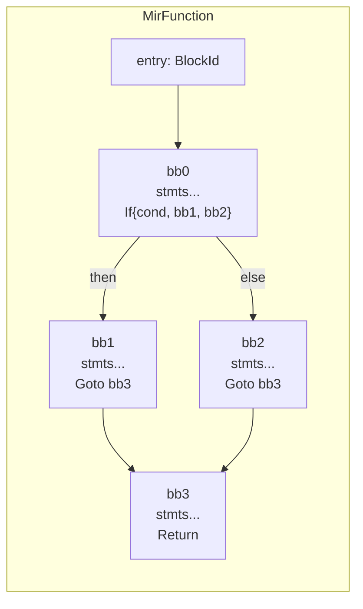
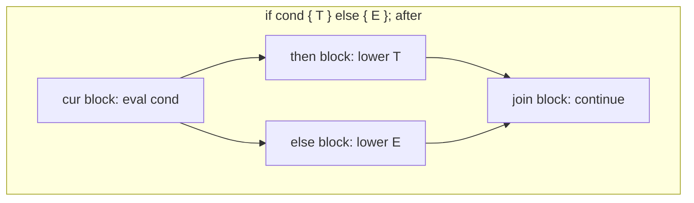
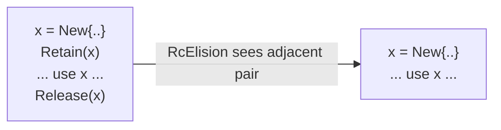

# 04 — CFG MIR (`src/mir/`)

MIR is where Dream becomes optimizable. It replaces structured control flow with an explicit
**control-flow graph** and replaces implicit memory management with **explicit refcount operations**.
Once a program is in MIR, ordinary dataflow analysis can reason about it.

## Mental model



- A function is a list of `BasicBlock`s plus an `entry` block id.
- Each block is `stmts: Vec<Statement>` then exactly one `terminator: Terminator`. Control can branch
  *only* at the terminator.
- Values live in `Local`s. Every intermediate result is materialized into a local, so an `Operand` is
  always either a local/global read or a constant — never a nested computation. This "flattening" is
  what makes the passes simple.

## Core types (`src/mir/mod.rs`)

### Statements — straight-line, no control flow

```rust
pub enum Statement {
    Assign(Place, Rvalue),  // place = rvalue
    Retain(Operand),        // refcount++
    Release(Operand),       // refcount-- (free at zero)
    Call { callee, args },  // call for effect; return value discarded
    Nop,                    // tombstone left by passes that delete without renumbering
}
```

### Terminators — exactly one per block

```rust
pub enum Terminator {
    Goto(BlockId),
    If { cond: Operand, then_blk, else_blk },
    Switch { value: Operand, targets: Vec<(i64, BlockId)>, default: BlockId },  // → br_table
    Return(Option<Operand>),
    Unreachable,   // #[default]
}
```

`Terminator::successors()` is the one place CFG edges are defined — every traversal (passes, DCE,
relooper) goes through it, so adding a terminator variant means updating exactly one function.

### Places, operands, constants

- `Place` (assignable): `Local`, `Global`, `Field { base, field }`, `Index { base, index: Box<Operand> }`.
  *(The `Box` breaks the `Place`→`Operand`→`Place` type cycle.)*
- `Operand` (readable): `Copy(Place)` or `Const(Const)`.
- `Const`: `Int`, `Float`, `Bool`, `Char`, `Str(String)` (interned later), `Null`.

### Rvalues — all real computation

```rust
pub enum Rvalue {
    Use(Operand),
    Binary(BinOp, Operand, Operand),
    Unary(UnOp, Operand),
    Call { callee, args },
    IndirectCall { target, args },
    New { def, args },                  // allocate + construct a struct
    UnionNew { def, variant, args },
    ArrayLit { elem_ty, elems },
    ArrayLen(Operand),
    Cast(Operand, TypeId),
}
```

`Callee { def, args, ret }` carries the resolved def, the concrete type args (for monomorphization),
and the site return type. The emitted symbol name is derived from `(def, args)` at the backend.

## Lowering HIR → MIR (`src/mir/lower.rs`)

`lower_program(hir, interner)` lowers each `HFunction` via `lower_function`; the `Lowerer` holds the
block list and an "current block" cursor and appends statements as it walks the structured HIR.

The essential trick is that **every structured construct becomes blocks + terminators**:



| HIR | MIR shape |
|-----|-----------|
| `If` | cur → `If{cond, then, else}`; both arms `Goto` a fresh join block |
| `While` | header block tests cond → body / exit; body `Goto`s header (back-edge) |
| `For` | init in cur; then a `While`-shaped header with the step appended to the body |
| `Foreach` | desugars to an index local + bounds check + `Index` read into the elem local |
| `Switch` | `Switch` terminator with `(value, block)` targets + default |
| `&&` / `\|\|` | short-circuit: a branch that skips the rhs block |
| `??` (`Coalesce`) | null-test branch choosing lhs or rhs |
| `Ternary` | same as `if` but both arms assign one result local |

Expression lowering (`lower_expr`) returns an `Operand`: literals become `Const`; everything composite
is assigned into a fresh temporary local and the temp is returned. `break`/`continue` consult a stack
of `(break_target, continue_target)` block ids maintained around loops.

`is_reference(ty)` delegates to `interner.is_reference` — the same single source of truth used
everywhere else.

## Why RC is explicit in MIR

Making `Retain`/`Release` ordinary statements (rather than implicit backend behavior) lets the
optimizer treat them like any other dataflow:



- `RcInsertion` (run *before* the optimization pipeline) conservatively inserts a `Retain` when a
  reference is copied/escapes and a `Release` when it dies.
- `RcElision` (in the pipeline) cancels redundant adjacent `Retain`/`Release` pairs that the other
  passes exposed.

See [05-writing-passes.md](./05-writing-passes.md) for the pass details.

## Building MIR by hand — `src/mir/build.rs`

`FunctionBuilder` is the ergonomic constructor used by tests and by anything that synthesizes MIR
directly (e.g. compiler-generated trampolines). It hands out fresh `Local`s and `BlockId`s, lets you
push statements into the current block, and finalizes a `MirFunction`. Use it instead of building the
structs by hand — it keeps the locals/blocks vectors consistent.

## Pretty-printing — `src/mir/print.rs`

MIR has a textual dump for debugging and snapshot tests. When a pass misbehaves, print the function
before and after; the CFG dump is far easier to read than the WAT.

## Invariants MIR guarantees to the backend

1. Every block ends in exactly one terminator; `entry` is a valid block id.
2. Operands are atomic (local/global/const) — no nested computation hides in an operand.
3. Every `Local` has a `LocalDecl` with a valid `TypeId`.
4. The CFG is **reducible** (Dream cannot express `goto` spaghetti), so the relooper always succeeds.
5. RC is balanced (every retained reference is released on every path) after `RcInsertion`.
