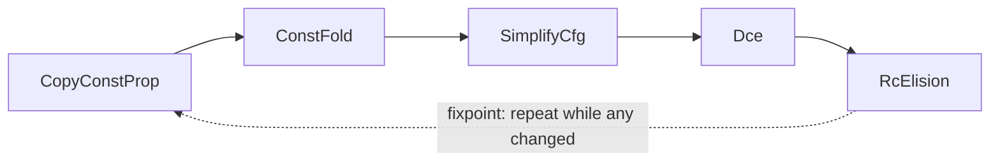

# 05 — Writing Optimization Passes (`src/mir/passes/`)

This is the document to read when you want to **make the compiler produce better code**. It covers the
pass infrastructure, every pass that ships today, and a complete step-by-step tutorial for adding your
own. Passes operate on MIR (read [04-mir.md](./04-mir.md) first).

## The contract: `MirPass`

Every pass implements one tiny trait (`src/mir/passes/mod.rs`):

```rust
pub trait MirPass {
    fn name(&self) -> &'static str;
    /// Transform one function. Return `true` iff anything changed.
    fn run(&self, func: &mut MirFunction, interner: &TypeInterner) -> bool;
}
```

Two rules make the whole system work:

1. **Function-local.** A pass sees one `MirFunction` at a time. (Interprocedural passes would need a
   different driver; none exist yet.)
2. **Report change honestly.** The return value drives a fixpoint loop, so returning `true` when
   nothing changed causes an infinite-ish loop (capped at `max_iterations = 16`), and returning
   `false` after a change means later passes miss the opportunity. Be precise.

## The pass manager

`PassManager` runs a configured list of passes **repeatedly until no pass reports a change** (or the
cap is hit). The shipped default (`PassManager::default_pipeline`) is ordered deliberately:



The ordering principle: **cheap rewrites that expose more work run first.** Propagation turns
`x = 1; y = x + 2` into `y = 1 + 2`, which folding turns into `y = 3`, which makes a branch constant,
which SimplifyCfg folds, which makes a block unreachable, which DCE deletes — and the now-dead RC ops
get elided. The fixpoint loop lets these cascade.

> `RcInsertion` is **not** in the default pipeline — it runs once *before* optimization to establish
> balanced refcounts. The pipeline only contains `RcElision`, which removes pairs the other passes
> expose.

## The passes that ship today

### `CopyConstProp` — `prop.rs`
Intra-block copy and constant propagation. Within a single block, if `x = <const|local>` and `x` is not
reassigned before a use, the use is rewritten to the source. Shrinks live ranges and feeds `ConstFold`.
*Intra-block only* — it does not reason across block boundaries (that would need real dataflow).

### `ConstFold` — `const_fold.rs`
Evaluates `Binary`/`Unary` rvalues whose operands are all `Const` and replaces them with the literal
result. Integer ops use `wrapping_*`; division/modulo by zero is **left for the runtime to trap** (the
fold returns `None`). This is the canonical "simplest pass" — read it before writing your own.

### `SimplifyCfg` — `simplify_cfg.rs`
Cleans up the graph: folds `If{cond: Const(bool), ..}` into a `Goto`, and threads jumps through empty
blocks (a block that is just `Goto t` is bypassed). Exposes unreachable blocks for DCE.

### `Dce` — `dce.rs`
Dead-code elimination, two kinds: (a) drop blocks unreachable from `entry` (graph reachability over
`Terminator::successors`); (b) remove assignments to locals that are never read, *but only when the
rvalue is pure* (a `Call`/`New` may have side effects and must stay even if its result is unused).

### `RcInsertion` / `RcElision` — `rc.rs`
`RcInsertion` conservatively inserts `Retain` when a reference is duplicated/escapes and `Release` when
it dies. `RcElision` cancels adjacent `Retain(x); Release(x)` (and `Release; Retain`) pairs that other
passes brought together. Correctness rule: **never make a program under-retain.** When unsure,
RcInsertion keeps the retain; RcElision only removes a pair it can prove is adjacent and cancelling.

## Tutorial: write a new pass (`Algebraic` simplification)

Goal: rewrite `x + 0 → x`, `x * 1 → x`, `x * 0 → 0`. This shows the full mechanics.

### Step 1 — create the file

`src/mir/passes/algebraic.rs`:

```rust
//! Algebraic identities: x+0, x-0, x*1, x*0, x/1.

use super::MirPass;
use crate::mir::{BinOp, Const, MirFunction, Operand, Rvalue, Statement};
use crate::types::TypeInterner;

pub struct Algebraic;

impl MirPass for Algebraic {
    fn name(&self) -> &'static str { "algebraic" }

    fn run(&self, func: &mut MirFunction, _interner: &TypeInterner) -> bool {
        let mut changed = false;
        for block in &mut func.blocks {
            for stmt in &mut block.stmts {
                if let Statement::Assign(_, rvalue) = stmt {
                    if let Some(simpler) = simplify(rvalue) {
                        *rvalue = simpler;
                        changed = true;
                    }
                }
            }
        }
        changed
    }
}

fn is_int(op: &Operand, n: i64) -> bool {
    matches!(op, Operand::Const(Const::Int(v)) if *v == n)
}

fn simplify(rvalue: &Rvalue) -> Option<Rvalue> {
    let Rvalue::Binary(op, a, b) = rvalue else { return None };
    match op {
        // x + 0  →  x   and   0 + x  →  x
        BinOp::Add if is_int(b, 0) => Some(Rvalue::Use(a.clone())),
        BinOp::Add if is_int(a, 0) => Some(Rvalue::Use(b.clone())),
        // x - 0  →  x
        BinOp::Sub if is_int(b, 0) => Some(Rvalue::Use(a.clone())),
        // x * 1  →  x   and   1 * x  →  x
        BinOp::Mul if is_int(b, 1) => Some(Rvalue::Use(a.clone())),
        BinOp::Mul if is_int(a, 1) => Some(Rvalue::Use(b.clone())),
        // x * 0  →  0   (only valid for pure x; operands here are already atomic and side-effect free)
        BinOp::Mul if is_int(a, 0) || is_int(b, 0) => Some(Rvalue::Use(Operand::Const(Const::Int(0)))),
        _ => None,
    }
}
```

> **Side-effect caveat.** `x * 0 → 0` is only safe because MIR operands are *atomic* — all real
> computation has already been hoisted into prior statements, so dropping `x` here drops only a
> register read, never a side effect. This is a concrete payoff of MIR's "operands are atomic"
> invariant.

### Step 2 — register it

In `src/mir/passes/mod.rs`:

```rust
mod algebraic;            // add with the other `mod` lines
pub use algebraic::Algebraic;
```

Add it to the pipeline where it composes well — before `ConstFold` so folded constants feed it and its
output feeds folding back on the next fixpoint iteration:

```rust
pub fn default_pipeline() -> Self {
    let mut pm = PassManager::new();
    pm.add(CopyConstProp);
    pm.add(Algebraic);     // ← new
    pm.add(ConstFold);
    pm.add(SimplifyCfg);
    pm.add(Dce);
    pm.add(RcElision);
    pm
}
```

### Step 3 — test it

Use `FunctionBuilder` (`src/mir/build.rs`) to construct a minimal function, run the pass, assert on the
result. Follow the pattern in `const_fold.rs`'s test:

```rust
#[cfg(test)]
mod tests {
    use super::*;
    use crate::mir::build::FunctionBuilder;
    use crate::mir::{Operand, Place, Rvalue, Terminator};

    #[test]
    fn mul_by_one_is_identity() {
        let i = TypeInterner::new();
        let mut b = FunctionBuilder::new("f", i.int());
        let x = b.new_param(i.int());
        let t = b.new_temp(i.int());
        b.assign(
            Place::Local(t),
            Rvalue::Binary(BinOp::Mul, Operand::Copy(Place::Local(x)), Operand::Const(Const::Int(1))),
        );
        b.terminate(Terminator::Return(Some(Operand::Copy(Place::Local(t)))));
        let mut func = b.finish();
        assert!(Algebraic.run(&mut func, &i));
        assert!(matches!(&func.blocks[0].stmts[0], Statement::Assign(_, Rvalue::Use(Operand::Copy(_)))));
    }
}
```

### Step 4 — verify nothing regressed

```bash
cargo test -p dream mir::          # the MIR unit + integration tests
cargo test --workspace            # e2e + determinism
cargo clippy --workspace --all-targets -- -D warnings
```

## Checklist & pitfalls for any new pass

- [ ] `run` returns `true` **iff** it mutated the function. No false positives (infinite work), no false
      negatives (missed cascades).
- [ ] Iterate to a local fixpoint *within* `run` only if cheap; otherwise rely on the manager's loop.
- [ ] **Never drop a statement with side effects** to delete its result. Only pure `Rvalue`s
      (`Use`/`Binary`/`Unary`/`Cast`/`ArrayLen`) are removable; `Call`/`New`/`UnionNew`/`ArrayLit`/
      `IndirectCall` may allocate or trap.
- [ ] Respect RC balance: don't delete a `Retain`/`Release` unless you can prove the pairing.
- [ ] Use `Terminator::successors()` for CFG traversal; don't hand-match terminator variants for edges.
- [ ] Determinism: iterate blocks/stmts in their existing `Vec` order; if you need a set/map, use
      `IndexMap`/`BTreeMap`, never `std::HashMap` (see [08](./08-testing-and-determinism.md)).
- [ ] Add a focused unit test with `FunctionBuilder` and keep the workspace green + clippy-clean.
