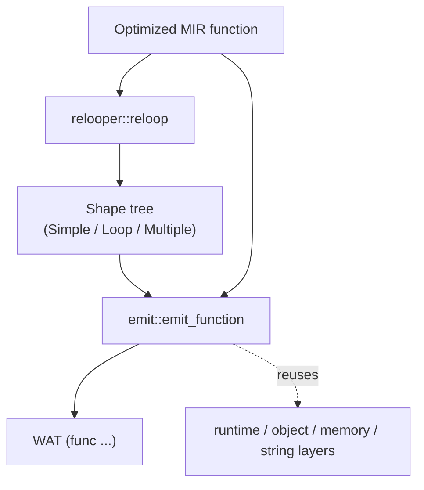
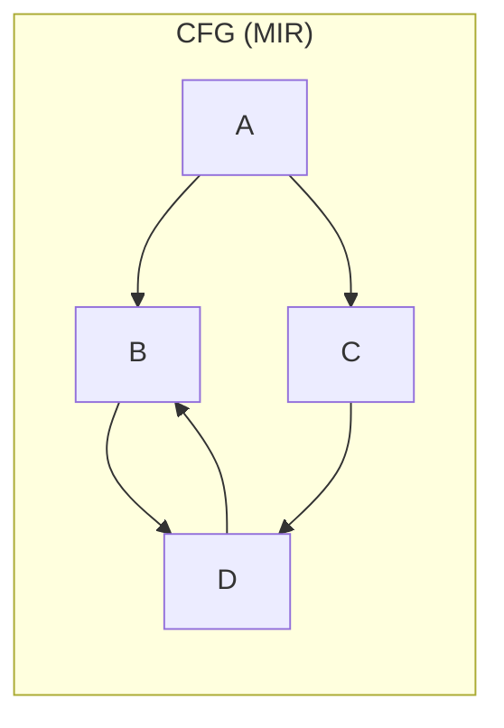
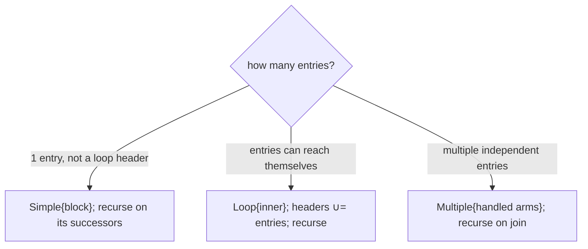
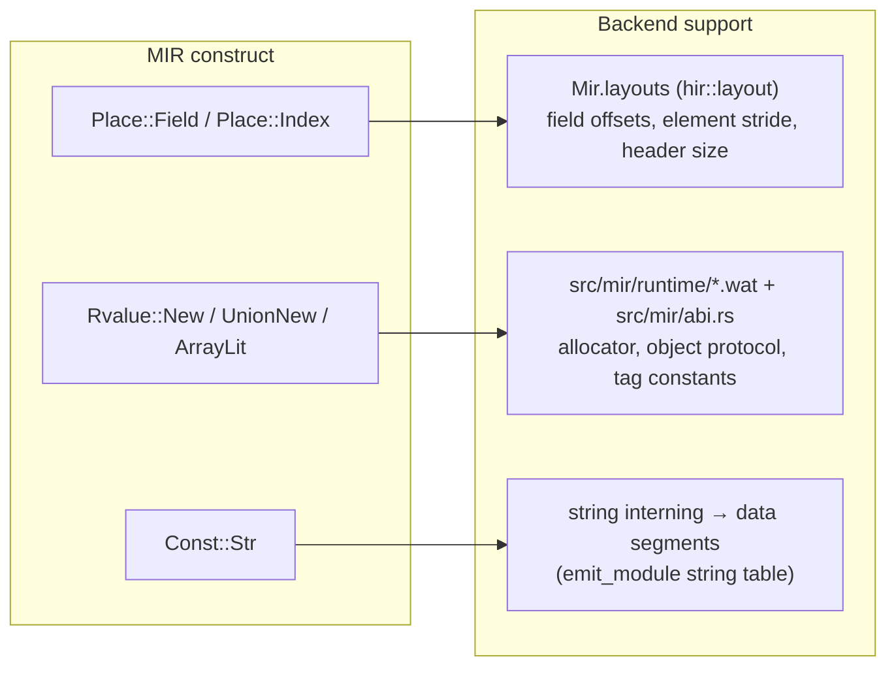

# 06 — Relooper & WAT Backend (`src/mir/relooper.rs`, `src/mir/emit.rs`)

The backend turns optimized MIR into WebAssembly text (WAT). The hard part is control flow: MIR is an
arbitrary (reducible) CFG, but WASM has **no `goto`** — only structured `block`/`loop`/`if` and
relative branches (`br`/`br_if`/`br_table`). The relooper bridges that gap.

## The two-layer backend



- `relooper::reloop(func) -> Option<Shape>` recovers structured shapes.
- `emit::emit_program / emit_function` walks the function and writes WAT, consulting the type interner
  for WASM value types and reusing the existing runtime layers for heap layout and strings.

## The relooper

### Why it is needed



A CFG like this (a diamond whose join loops back) cannot be written directly in WASM. The relooper
discovers that `B → D → B` forms a loop and that `A` branches into two arms, and produces a tree of
**shapes** the emitter can translate to nested `block`/`loop`/`if`.

### Shapes — `Shape` enum

```rust
pub enum Shape {
    Simple   { block: BlockId,       next: Option<Box<Shape>> }, // one block, then the rest
    Loop     { inner: Box<Shape>,    next: Option<Box<Shape>> }, // cyclic region in a `loop`, then rest
    Multiple { handled: Vec<Shape>,  next: Option<Box<Shape>> }, // independent arms, then the join
}
```

### The algorithm (`Relooper::make`)

`make(entries, within, headers)` recursively builds the shape for the sub-CFG restricted to `within`,
entered at `entries`, where `headers` are the entry blocks of *enclosing* loops:



The single subtle point — and the bug that was fixed during development — is **back-edges**. Inside a
`Loop`, an edge back to the loop header is a `continue`, *not* forward control flow. So `succs` and
`reach` **filter out `headers`**: they never traverse back into an enclosing loop's entry. Without this
filter, `make_loop` re-detects the header as a fresh loop entry and recurses forever (stack overflow).
This is why `headers: &BTreeSet<BlockId>` is threaded through every recursive call.

Because Dream's surface syntax only generates reducible CFGs, `reloop` always returns `Some`. It is
typed `Option<Shape>` so an irreducible graph fails loudly rather than miscompiling.

## The emitter (`emit.rs`)

### Today: a dispatch loop

The current emitter does **not** yet consume the relooper shapes. Instead it uses a
**labeled-block dispatch loop**: a `$blockidx` local holds "which block to run next", an outer `loop`
wraps a `br_table` that jumps to the current block's code, each block ends by setting `$blockidx` and
`br`-ing back to the dispatch, and `Return` exits. This is correct for *any* reducible CFG and was the
fastest way to get a working backend.

```wat
(func $f (param ...) (result ...)
  (local $blockidx i32)
  (loop $dispatch
    (block $bb2 (block $bb1 (block $bb0
      (br_table $bb0 $bb1 $bb2 (local.get $blockidx))))
      ;; bb0 code ... (local.set $blockidx (...)) (br $dispatch)
    ) ;; bb1 ...
  )
)
```

The relooper output is the basis for the **planned refinement**: emit idiomatic nested
`block`/`loop`/`if` (smaller, faster, friendlier to the WASM engine's own optimizer) instead of the
dispatch loop. The shape tree is already produced and tested; wiring `emit` to walk it is the next
backend task.

### Statements, operands, types

- `wasm_ty(TypeId)` maps interned types to WASM value types: `i32` for ints/bools/chars/refs (pointers),
  `i64` for longs, `f32`/`f64` for floats. Reference types are `i32` pointers into linear memory.
- `binop_instr` picks the instruction from `(BinOp, operand type)` — e.g. `i32.add`, `f64.mul`,
  `i32.lt_s` vs `i32.lt_u` based on signedness.
- Operands lower trivially: `Const` → `i32.const`/`f64.const`/…; `Copy(Place::Local)` → `local.get`.

### Runtime integration points

Three families of operations lean on the embedded runtime layers and the layout tables carried down
from HIR:



- **Field/index access** uses the struct/array **layout** in `Mir.layouts` (built by `hir::layout` and
  threaded through lowering) to compute `base + offset` loads/stores with width-aware ops.
- **Allocation/construction** (`New`, `UnionNew`, `ArrayLit`) emits an inline `$malloc(size, tag)` —
  tag from `mir::abi` — then sets the header/refcount, initializes fields/elements, and calls the
  user constructor (`$Type_constructor`) when one exists.
- **String constants** are interned by `emit_module` into `[len][utf8][\0]` data segments, so identical
  literals share one pointer.

The allocator, string, object-protocol, float/double formatter, and async scheduler runtimes are the
hand-written `.wat` files in `src/mir/runtime/`, embedded via `include_str!` and stitched into every
module with their `{TAG_*}`/`{minus}` placeholders resolved from `mir::abi`.

## Determinism in the backend

The emitter must be a pure function of the MIR. Iterate `Vec`s in order; never iterate a
`std::HashMap`. Any lookup tables introduced (string pool, function index map) must be `IndexMap`/
`BTreeMap` so two runs emit identical WAT. The `codegen_is_deterministic` e2e test enforces this.
