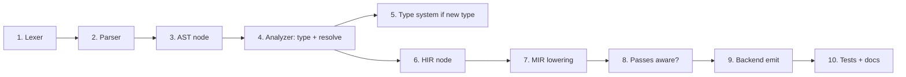
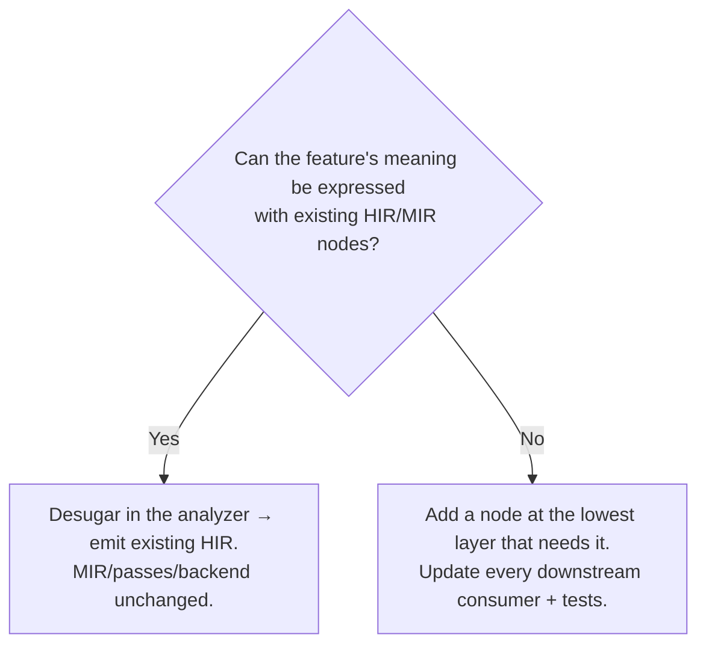

# 07 — Adding a Language Feature (end to end)

This document is the "I want to add syntax X to Dream" checklist. It walks one feature through *every*
stage so you can see which files each stage lives in and what each stage must contribute. Use it as a
template and a completeness check.

## The mental checklist



A feature is "done" only when every box that applies is ticked. Skipping a box is how you get a parser
that accepts syntax the backend silently ignores.

## Worked example: a `repeat (n) { ... }` loop

Surface syntax: `repeat (expr) { body }` runs `body` `expr` times. It is sugar for a counted loop, so
it needs no new *type*, but it touches every other stage.

### 1. Lexer — `crates/dream-syntax/src/lexer/`

Add the `repeat` keyword. If the lexer keys keywords off a table/match, add `"repeat" => TokenKind::Repeat`
and the `Repeat` token kind. Keywords are usually a closed set — grep for an existing one like `while`
to find every place that needs the new arm.

### 2. Parser — `crates/dream-syntax/src/parser/`

In statement parsing, when the current token is `Repeat`:
- consume `repeat`, expect `(`, parse a count `ExpressionNode`, expect `)`,
- parse a braced block of statements,
- build the AST node.

Mirror the existing `while` parser; it is the closest analog. Report a diagnostic (don't panic) on
malformed input.

### 3. AST — `crates/dream-syntax/src/nodes/`

Add a statement variant:

```rust
StatementNode::Repeat { count: ExpressionNode, body: Vec<StatementNode>, span: TextSpan }
```

Update any exhaustive `match` over `StatementNode` (the compiler will list them) across the parser,
analyzer, and HIR emission so the crate still compiles.

### 4. Analyzer — `src/semantics/analyzer/statements.rs`

Type-check it:
- analyze `count`, require it to be an integer type (`assignable` to `int`); emit a diagnostic
  otherwise.
- open a loop scope (so `break`/`continue` are legal inside), analyze `body`, close the scope.

### 5. Type system — `src/types/`

Nothing: `repeat` introduces no new type. (If your feature *did* — e.g. a tuple type — you would add a
`TyKind` variant and a `lower` arm; see [02-type-system.md](./02-type-system.md).)

### 6. HIR — `src/hir/mod.rs`

You have a choice: add a dedicated `HStmt::Repeat` or **desugar to an existing node**. Prefer desugaring
when the semantics are exactly an existing construct — fewer nodes means fewer cases in every downstream
consumer. `repeat (n) { body }` is exactly:

```
let __i = 0;
while (__i < n) { body; __i = __i + 1; }
```

So the analyzer emits the existing `HStmt::While` (or `HStmt::For`) with a synthetic counter local
instead of a new variant. Now MIR, passes, and the backend need **zero** changes — they already handle
`While`. This is the single most important lesson in this doc: **desugar in the front end whenever the
meaning is expressible in existing IR.**

> Add a new HIR/MIR node only when the construct is genuinely irreducible to existing ones (e.g. a new
> kind of value, a new effect, or something the optimizer must treat specially).

### 7. MIR lowering — `src/mir/lower.rs`

Nothing, if you desugared to `While`. If you instead added `HStmt::Repeat`, add a `lower_stmt` arm that
builds the header/body/exit blocks (copy the `While` lowering and append the counter increment to the
body).

### 8. Passes — `src/mir/passes/`

Usually nothing: passes operate on generic blocks/statements, not surface constructs. A constant
`repeat (3)` will even get unrolled-ish benefits indirectly via const-prop/fold + simplify-cfg without
special-casing.

### 9. Backend — `src/mir/emit.rs`

Nothing, if you desugared. New MIR nodes (not the case here) would need emit arms.

### 10. Tests & docs

- A parser test in `dream-syntax` (accepts valid, rejects malformed).
- An analyzer test (rejects non-integer count).
- An e2e fixture under `tests/` that runs a `repeat` program and checks output.
- A line in the language reference / `GEMINI.md`.

## The decision that saves you the most work



Most "new syntax" is sugar. Reserve new IR nodes for new *semantics*. When you must add a node, add it
as low as possible (prefer a new `Rvalue` over a new `HExprKind` if MIR is the first place it becomes
distinct) to minimize the number of stages that must learn about it.

## Special cases worth knowing

- **New binary/unary operator:** add to `hir::BinOp`/`UnOp` (`src/hir/ops.rs`), map the token in the
  analyzer, fold it in `ConstFold`, and emit it in `binop_instr` — those four spots.
- **New type:** the dedicated checklist is in [02-type-system.md](./02-type-system.md#how-to-add-a-new-type-to-the-language).
- **New heap-allocated value:** add the `Rvalue` (e.g. `New`-like), and wire its layout/alloc through
  the runtime layer in the backend (see [06](./06-relooper-and-backend.md)); update `RcInsertion` so
  it is retained/released.
- **New control-flow construct that is *not* sugar:** add `HStmt` + `lower.rs` arm; ensure
  `Terminator::successors()` still describes all edges so passes/relooper stay correct.
