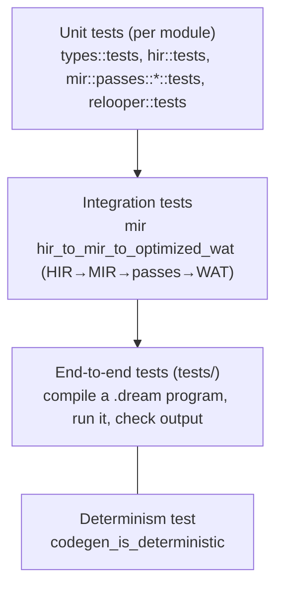
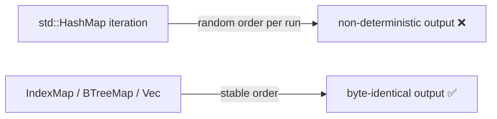
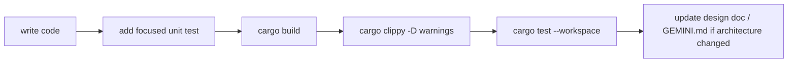

# 08 — Testing, Determinism & Conventions

This document covers how the compiler is tested, the determinism contract that the whole back end must
honor, and the conventions every contributor is expected to follow.

## The test pyramid



### Unit tests
Each module tests its own logic with the smallest possible input. Passes use `FunctionBuilder`
(`src/mir/build.rs`) to construct a tiny `MirFunction`, run the pass, and assert on the result. The
type system tests interning, nullable collapsing, reference classification, display, and compat. Run a
focused subset with a path filter:

```bash
cargo test -p dream types::
cargo test -p dream mir::passes::
cargo test -p dream relooper::
```

### Integration test
`src/mir/mod.rs::tests::hir_to_mir_to_optimized_wat` exercises the entire new middle/back end in one
shot: build typed HIR by hand → `lower_function` → `PassManager::default_pipeline` → `emit`. When you
change lowering, passes, or emission, this is the fastest signal that the stages still compose.

### End-to-end tests — `tests/`
`tests/e2e_tests.rs` compiles real `.dream` programs and checks behavior. These are the source of
truth for "does the compiler actually work". They currently exercise the **legacy** backend; the MIR
backend must pass the same set before the driver switch (see [09](./09-migration-status.md)).

### Determinism test — `codegen_is_deterministic` (`tests/e2e_tests.rs:208`)
Compiles the same input twice and asserts byte-identical output. This guards the contract below.

## The determinism contract

> **Two compilations of the same source must produce byte-identical `.wat`/`.wasm`.**

This is non-negotiable: it makes builds reproducible, caching sound, and diffs meaningful. The only
realistic way to break it is **iteration order of a hash map**. Rules:

- **Never iterate `std::collections::HashMap`** in any code that influences emission (or its ordering).
- Use `indexmap::IndexMap` when you need insertion-order iteration with hash lookup, or `BTreeMap` when
  you need sorted iteration. The codebase already standardized the emission-driving maps on `IndexMap`
  (struct/union/enum/symbol tables, codegen string/function/global maps).
- The `TypeInterner` assigns ids in first-seen order and stores them in a `Vec`; iterating types by
  `TypeId` is therefore deterministic.
- When you add a lookup structure to a pass or the emitter, pick `IndexMap`/`BTreeMap` deliberately and
  add/extend a determinism assertion if it feeds output.



## The pre-commit gate

Before considering any change done, all three must pass:

```bash
cargo build --workspace
cargo clippy --workspace --all-targets -- -D warnings
cargo test --workspace
```

Clippy is run with `-D warnings`: the project's stance (set by the maintainer) is **fix the root cause,
do not `#[allow]`**. The only surviving `#[allow]`s annotate *external* API constraints (e.g. an
`lsp-types` field that is `deprecated` upstream) and carry a comment explaining why.

## Coding conventions

### Comments
Comments explain **intent, invariants, and trade-offs** — the *why*. They must not narrate the code.
Delete `// increment counter` and `/// Builds X` stub banners. Good comments look like the module
headers in `src/mir/mod.rs` (what the IR guarantees) or the back-edge note in `relooper.rs` (a subtle
correctness reason).

### Errors
The back end uses the typed `CodegenError` (`src/codegen/mod.rs`):

| Variant | Use when |
|---------|----------|
| `Unsupported` | a valid program uses a construct the backend can't emit yet (user-actionable) |
| `Internal` | an invariant the analyzer should have guaranteed was violated (compiler bug / ICE) |
| `UnknownSymbol`/`UnknownType`/`UnknownDef` | a resolution that must not fail post-analysis did |

Never `panic!`/`unwrap` on program-dependent conditions — return a `CodegenError`. Panics are only for
truly impossible states, and even those are better as `Internal`.

### No pre-release back-compat
The compiler is unreleased. Do **not** add deprecation shims, re-export facades, or "keep the old path
working" layers. When you replace something, delete the old thing (this is exactly what the migration
in [09](./09-migration-status.md) does). Back-compat is debt we have not earned yet.

### Determinism by default
Reach for `IndexMap`/`BTreeMap`/`Vec` first. Only use `HashMap` for throwaway local computations whose
iteration order never escapes into output.

## A good change, end to end


