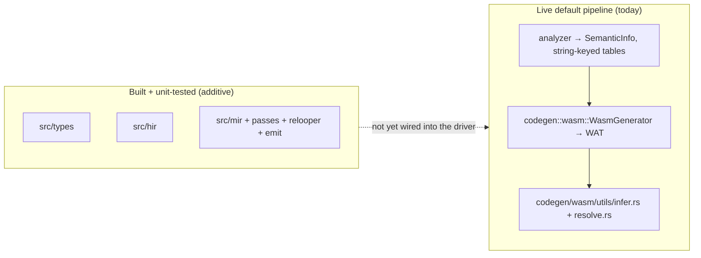
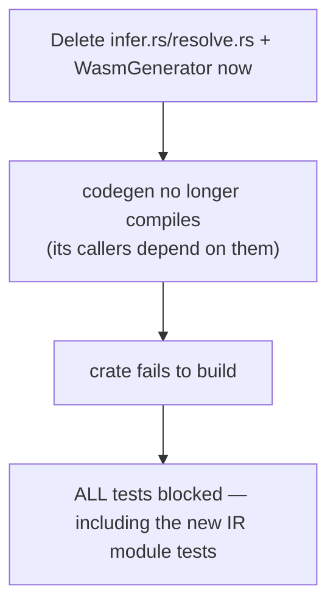
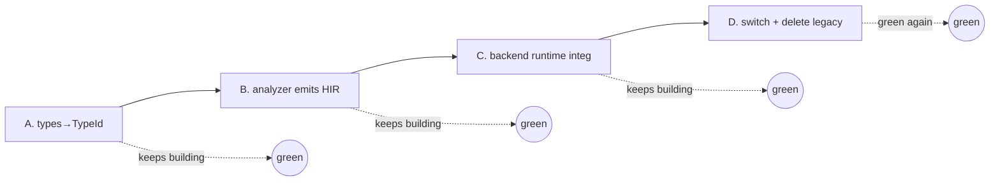

# 09 — Migration Status & The Safe Path to Finish

This document is the honest, current state of the architecture migration: what is **built**, what is
**wired**, what is **not yet wired**, and the exact order to finish without ever leaving a non-building
or untestable compiler. Update it as the work lands.

## Status at a glance

| Component | State |
|-----------|-------|
| `src/types/` (interner, TyKind, DefId, compat, display, `TypeCtx`) | ✅ built, tested |
| `src/hir/` (typed HIR data model) | ✅ built, tested |
| `src/mir/` (CFG, lowering, passes, relooper, emit) | ✅ built, tested |
| `TypeCtx` threaded through the analyzer; all nominal decls register a `DefId` | ✅ done (Step A foundation) |
| Generic representation unified (mangled `List_JsonValue` ≡ structured `List<JsonValue>`) | ✅ done (`TypeCtx.instances` + `lower_name`) |
| Analyzer assignability on `TypeId` (`compare_data_type`, `type_str_assignable` → `compat::assignable`) | ✅ done |
| Overload viability on `TypeId` | ◐ deferred — string mirror (`overload_arg_compatible`) is already semantically equivalent; blocked only by the `Fn(&str,&str)` closure signature in `select_overload` |
| Analyzer tables keyed by `TypeId` (not strings) | ◐ next — tables still store `Type`/strings (legacy-codegen bridge) |
| New backend pipeline composes (HIR → `mir::lower` → all passes → `emit`) | ✅ proven green by `tests/mir_pipeline.rs` (incl. determinism); the Step C cutover target |
| MIR backend emits a self-consistent module (`emit_module`) with call sites resolving to headers, and per-`(DefId, instance)` symbols | ✅ done (Step C.0) — `MirFunction.def`/`.instance`, `func_symbol`/`symbol_table`; unblocks generics' distinct symbols |
| Analyzer **emits** HIR | ✅ complete for everything the current MIR backend can consume — interleaved via `hir_emit.rs`: control flow, `switch`/`match` (statement *and* expression), methods + instance/static calls, constructors, fields, enums, unions, globals (+ initializers), `len()`, async/await, **and generic free functions** (emitted per-monomorphization; see Step C.5) |
| MIR backend field/index access (struct field + array element read/write) | ✅ done (Step C.1) — `Hir.layouts`/`Mir.layouts` (`hir::layout`), threaded to `emit.rs`; offset arithmetic + width-aware loads/stores |
| MIR backend allocation (`New`, `ArrayLit`) + string interning (`Const::Str`) | ✅ done (Step C.2/C.3) — inline `$malloc(size, tag)` + field/element init via a `$__obj` scratch; strings interned to `[len][utf8][\0]` data segments emitted by `emit_module` |
| MIR backend emits an **assemblable** module (`emit_module`) | ✅ done (Step C.4) — `(memory)`, allocator runtime (`$malloc`/`$free`/`$retain`/`$release_generic`), heap/freelist globals above the string segment, module-level `$g{n}` globals, data segments, host exports; verified via `wat::parse_str` |
| MIR backend emits generic instances + resolves generic call sites | ✅ done (Step C.5) — HIR `Callee`/`New` carry `instance: Vec<TypeId>`; the analyzer emits one `HFunction` per monomorphization (bindings lowered in binding order) and resolves generic free-function calls to `(base DefId, instance)`; `symbol_table` keys `(DefId, instance)` → symbol so bodies and call sites agree. **Generic-struct methods** (e.g. `Box<int>.get`) and **generic-struct construction** (`Box<int>(…)`) also work: their specialization is baked into the mangled name, and layouts are keyed by the interned **type id** so each monomorphization has its own field widths (Step C.5b). *Only generic **methods with their own type parameters** remain deferred.* |
| MIR backend union construction (`UnionNew`) + global initializers | ✅ done (Step C.2b) — union values allocate a `[discriminant][payload]` block via the union layout (`LayoutTable.unions`); top-level variable initializers are captured (`HGlobal.init`) and run in a synthesized `$__dream_init` wired to `(start ...)` |
| MIR backend handles user-defined constructor bodies | ✅ done (Step C.2c) — `New` carries an optional `ctor` def; when present the backend allocates, zeroes the fields, then calls `$Type_constructor(this, args)` (whose body is emitted via `struct_methods`); otherwise it inlines positional field init |
| `extend` blocks (generic + non-generic) | ✅ done — extension methods lower exactly like struct methods (`{Type}_{method}` + implicit `this`), so their bodies emit and calls resolve; generic `extend Box<T>` monomorphizes alongside the struct instance (`Box_int_peek`). Covered by `test_hir_emission_extend_{nongeneric,generic}_class` |
| `del()` destructors | ◐ **body** emits under `{Type}_del` (like any method; `test_hir_emission_destructor_body`), but the release-time **invocation** (per-type deep release: pin refcount → call `$Type_del` → release ref fields → free) is part of the RC runtime, still deferred with the rest of the release layer (Step D) |
| Driver uses the MIR backend | ◐ **opt-in wired** — `Compiler::with_mir(true)` / CLI `--mir` routes analysis → HIR → `mir::lower` → `prune_unreachable` → passes → `emit_module`. Default is still `WasmGenerator`; the flip waits on full coverage. Gated by `tests/mir_e2e.rs` (**74 / 84** golden e2e cases pass end-to-end through the real driver front-end + MIR backend) |
| `infer.rs` / `resolve.rs` deletable | ❌ still used by the live backend |

The new architecture is **complete as modules** but **not on the critical path**. The legacy backend is
still the only thing that compiles real programs.

## The ordering constraint (why we can't just delete the old code)

Deleting the legacy backend before the new one can compile real programs yields a **non-building**
crate. That is strictly worse than "tests fail", because a non-building crate blocks even the new
modules' own tests. So the migration must keep the crate building at every step. The linchpin that
unlocks the deletions is **analyzer → HIR emission**: nothing can replace `infer`/`resolve`/the
AST-walker until there is an HIR to feed the new pipeline.

## The safe sequence

Do these in order. Each step keeps `cargo build --workspace` green; the gate to advance is the test
command listed.

### Step A — Type-system migration tail (Phase 1)
Switch the analyzer's tables and compat code off strings onto `TypeId`/`DefId`.

1. **[done]** Thread a `TypeCtx` through `Analyzer` (owns the interner + def table for the whole
   analysis) and register every declaration — structs, unions, enums, functions, methods, and each
   generic instantiation — as a `DefId` as it is discovered.
2. **[done] Unify the generic representation FIRST (discovered constraint).** The analyzer used two
   interchangeable spellings for the same generic instance: the *structured* `Type::Struct("List",
   Some([JsonValue]))` and the *pre-mangled bare* `Type::Struct("List_JsonValue", None)`. The legacy
   string check normalized both via `get_type()` to `"List_JsonValue"`, but `TypeCtx::lower` interned
   them as **different** `TypeId`s. Fixed by: (a) `TypeCtx.instances` — each `ensure_*_instantiated`
   calls `register_instance(kind, base, args)`, recording `mangled → Struct/Union(base_def, args)`;
   and (b) `TypeCtx::lower_name` — a bare `Type::Struct(name, None)` is normalized for array/nullable
   suffixes, primitive spellings, and the `instances` map, so every spelling interns to one `TypeId`.
   This also absorbed a second hazard: helpers like `concrete_type_from_str` build malformed
   `Type::Struct("byte[]", None)` for generic bindings; `lower_name` re-parses the suffix to `Array`.
3. **[done] Assignability on `TypeId`.** `compare_data_type` (`expressions.rs`) and
   `type_str_assignable` (`calls.rs`) now lower both operands (`TypeCtx::lower` / `lower_str`) and call
   `compat::assignable`, replacing the hand-rolled `get_type()` string ladders. Poison (`unknown`)
   stays an explicit name check (no dedicated interned id).
4. **[deferred] Overload viability on `TypeId`.** `overload_arg_compatible` is already semantically
   equivalent to `compat::overload_compatible`, and overload scoring compares `get_type()` strings on
   both sides consistently (no dual-spelling hazard), so it is correct as-is. Swapping it is blocked
   only by the `Fn(&str,&str)` signature of `select_overload`; do it when that signature is revisited.
5. Change `StructTable`/`UnionTable`/`EnumTable`/`FunctionTable`/`SymbolTable` to store `TypeId`
   alongside the legacy string (`src/semantics/*_table.rs`). The legacy codegen still reads the string,
   so keep both until Step C.
6. Replace mangled-name monomorphization keys with `(DefId, Vec<TypeId>)` — the same canonical
   representation `register_instance` already computes.

*Gate:* `cargo test --workspace` (legacy backend still consumes the tables; keep a thin `display_name`
bridge where it currently needs a string until Step C removes those call sites).

> **Empirically established (this iteration):** A.1–A.3 are landed and green (workspace builds,
> `cargo test -p dream` incl. determinism passes, `clippy -D warnings` clean). A.4 is deferred (not
> blocking), A.5/A.6 are the remaining table-keying work.

### Step B — HIR emission (Phase 2, the linchpin)
Make the analyzer build an `Hir` alongside `SemanticInfo`.

1. As each function is type-checked, emit `HFunction` with typed `HExpr`/`HStmt`, resolved
   `Binding`/`Callee`, and explicit `Cast` coercions.
2. Push `MonoInstance`s as generic uses are discovered.
3. Add an integration test: a representative `.dream` program → analyzer → HIR → `mir::lower` →
   passes → `emit`, asserting the WAT compiles/runs.

> **Discovered constraint:** the analyzer types each expression *inline* during analysis and
> discards the result — only the `SemanticInfo` tables survive (no per-node type map on the AST). So
> HIR **cannot** be a clean post-analysis pass; `HExpr`/`HStmt` must be built *as* each node is
> type-checked. This is done interleaved via `src/semantics/analyzer/hir_emit.rs`.

**Interleave mechanism (transitional).** `HirEmit` (a field on `Analyzer`) records each expression's
`HExpr` into a `last` side-channel — so the ~50 `analyze_expression` call sites did not all need their
signatures changed at once — and appends an `HStmt` per supported statement. A function is emitted
only if **every** construct in it is already supported; the first unsupported one flips `ok = false`
and the function is skipped, leaving analyzer behavior and the legacy backend unchanged. The emitted
`Hir` is surfaced on `SemanticInfo::hir`. The `last` side-channel is a migration scaffold; it is
replaced by threading `HExpr` through return values once coverage is complete.

Nested control flow is collected with a **block stack** (`HirEmit::blocks`): the bottom frame is the
function body, and each loop/branch handler pushes a frame around its nested body
(`hir_open_block`/`hir_close_block`, paired on `collecting` so they stay balanced even after `ok`
flips) and attaches the popped statements to the control-flow node it builds.

**Slice status:**
- ✅ **Slice 1 (done, green):** non-generic, non-static free functions with flat bodies —
  `let`/assignment-to-local/`return`/expression statements over int/float/bool/char literals, local &
  parameter reads, unary, and arithmetic/comparison/bitwise binary ops. Validated end-to-end (source →
  analyzer-emitted HIR → `lower → passes → emit`) by `test_hir_emission_*` in `analyzer_tests.rs`.
- ✅ **Slice 2 (done, green):** control flow — `if`/`else if`/`else` (folded into nested `HStmt::If`),
  `while`, C-style `for (init; cond; step)`, for-each (`for (let x in xs)`), and `break`/`continue`.
  `is`-conditions (which fold to compile-time constants), `do`/`while`, `switch`, and labeled loops
  remain out of coverage (they flip `ok = false`). Validated by `test_hir_emission_while_loop`,
  `_if_else_chain`, `_for_loop`, and `_foreach_loop` (each runs the full `lower → passes → emit` chain
  and asserts the CFG shape).
- ✅ **Slice 3a (done, green):** expression breadth that needs no nominal layout — short-circuit
  `&&`/`||`, ternary `?:`, null-coalescing `??`, string & `null` literals, C-style casts `(T)e`,
  array literals `[..]`, array indexing `a[i]` (read), and **direct** free-function calls (resolved
  to the callee's `DefId`; generic/overloaded/async/indirect/constructor calls stay on the legacy
  path). Validated by `test_hir_emission_logical_and_ternary`, `_coalesce`, `_cast`,
  `_index_and_array_literal`, `_direct_call`, and `_string_literal`. Layout/string-backed forms emit
  Step-C `;; TODO` placeholders but the pipeline composes deterministically.
- ✅ **Slice 3b (done, green):** the non-dispatch nominal forms — struct-field read (`obj.f`) and
  field assignment (`obj.f = v`), indexed assignment (`a[i] = v`), (non-generic) constructors
  (`Struct(args)` → `New`), and enum-member values (`Enum.Member` → `EnumValue`). Field indices are
  resolved from the struct layout in **offset order** (`Analyzer::struct_field_index`), matching the
  auto-generated constructor's argument order and the backend's field indexing. Validated by
  `test_hir_emission_field_read_and_constructor`, `_field_assignment`, `_index_assignment`, and
  `_enum_value`. Field/array/constructor emission is still a Step-C `;; TODO(layout)` placeholder.
- ✅ **Slice 3c (done, green):** the dispatch/binding-heavy nominal forms. `hir_begin_function` no
  longer skips methods — `this` is simply parameter 0, so **method bodies are now emitted** under
  their mangled `{Type}_{method}` name (static methods too; bodies analyzed under active generic
  substitution are still deferred). Calls resolve to a `Callee`/`DefId`: **instance method calls**
  (`obj.m(a)` → `MethodCall` with the receiver), **static method calls** (`Type.m(a)` → `Call`),
  and bare call statements (`f(x);` / `o.m();` → expression statements). **Union construction**
  (`Enum.Variant(args)` and unit `Enum.Variant` → `UnionNew`, carrying the union `DefId` and the
  variant discriminant) is covered for concrete unions. **Module globals** read/write resolve to
  `Binding::Global`/`HPlace::Global` against a slot table populated by `hir_register_globals`
  (after globals are analyzed), and the surfaced `Hir.globals` now lists each `HGlobal`, with its
  initializer captured into `HGlobal.init` (Step C.2b). Out of coverage: builtin methods
  (`len`/`to_string`/`char_at`/…), overloaded call targets, and generic *struct* construction (needs
  per-instance layouts). Validated by `test_hir_emission_method_body_and_instance_call`,
  `_static_call`, `_global_read_and_write`, `_union_construction`, and
  `_global_initializer_runs_in_start`.
- ✅ **Slice 3d (done, green):** `switch` statements and **statement-position `match`** both lower to
  `HStmt::Switch`. `switch` cases become `Const` arms — a multi-label `case 1, 2:` emits one arm per
  label sharing a clone of the body — with the `default` clause as the fallthrough block.
  Statement-`match` builds `Const`/`Variant`/`Wildcard`-as-default arms; a variant pattern allocates
  a fresh HIR local per payload field (in field order) — via `hir_match_pattern` — so the arm body
  resolves the bindings. Guarded arms and bind-whole-value patterns drop coverage. Validated by
  `test_hir_emission_switch_statement` and `_match_statement_with_variant_binding`.
- ✅ **Slice 3e (done, green):** the remaining expression/effect forms. **match-*expression*** (value
  position) desugars to a result temporary + the same `Switch`, with each arm assigning the temp and
  the whole match reading it back (`analyze_match`'s `is_expression` path). The **`len()` builtin**
  lowers to `ArrayLen` (`arr.len()`/`str.len()`). **async/await** is now representable: `async`
  bodies emit with `is_async` set, an `async` call carries its `Future<T>` return type, and `await`
  (expression and statement) emit `HExprKind::Await`/`HStmt::Await`. Validated by
  `test_hir_emission_match_expression`, `_len_builtin`, and `_async_await`. The remaining unsupported
  builtins (`to_string`/`char_at`/`hash_code`) need runtime defs and stay on the legacy path.
- ✅ **Generics — done in Step C.5/C.5b:** the backend now gives each `(DefId, instance)` a distinct
  symbol (`func_symbol` appends `__<typeids>`; `symbol_table` keys `(DefId, instance)`), so
  monomorphized bodies and their call sites agree. The analyzer emits one `HFunction` per
  monomorphization (lowering `current_generic_bindings` to `Callee.instance`/`HFunction.instance`),
  and generic free-function calls resolve to `(base DefId, instance)`. **Generic-struct methods and
  construction** also work: their specialization is baked into the mangled name (empty instance), and
  `LayoutTable` is keyed by the interned **type id** so each monomorphization has its own field
  widths. **Still deferred:** generic **methods with their own type parameters**.

*Gate per slice:* `cargo test --workspace` stays green (legacy path unaffected; HIR coverage grows).
*Gate to finish B:* analyzer emits HIR for the whole language; then `infer.rs`/`resolve.rs` can go.

### Step C — Backend runtime integration (Phase 5)
Teach `emit.rs` the heap.

0. **[done] Self-consistent module + symbol scheme (prerequisite for everything below and for
   generics).** `MirFunction` now carries its `def: DefId` and `instance: Vec<TypeId>` (threaded from
   `HFunction` in `lower_function`). `emit.rs` derives the emitted symbol from `(name, instance)` via
   `func_symbol` (instance args are suffixed, e.g. `id__12`, so monomorphizations stay distinct), and
   `symbol_table` maps every `DefId → symbol` so call sites — which carry only `callee.def` — resolve
   to the **same** symbol the header uses (was the broken `$def{N}`-vs-`$name` mismatch). `emit_module`
   wraps the functions in a single `(module …)` and exports each non-instance function under its source
   name; `emit_program` (no wrapper) stays the pipeline-test entry point. Validated by
   `mir::emit::tests::{module_wraps_and_resolves_call_symbols, instance_functions_get_distinct_symbols}`.
   With this, emitting generic instances is now a matter of giving each `(DefId, args)` its own
   `MirFunction` — the symbols already separate.
1. **[done] Field/index layout.** `src/hir/layout.rs` defines `LayoutTable`/`TypeLayout`/`FieldLayout`
   and a single `scalar_size` rule. The analyzer builds the table from its struct table
   (`Analyzer::hir_build_layouts`, keyed by each struct's `DefId`, fields in declaration/offset order)
   and surfaces it on `Hir.layouts`; `lower_program` copies it to `Mir.layouts`; `emit.rs` threads it
   into the `Emitter`. `Place::Field` lowers to `base + offset` + a width-aware load/store
   (`i32`/`i64`/`f32`/`f64`, sub-word `i32.load8_u`/`i32.store8`); `Place::Index` lowers to
   `base + 4 + i*stride` (the length is the first word). Union field access and exact byte-parity with
   the legacy `value_size_align` (which quirkily sizes `long` as 4) are reconciled at Step D. Validated
   by `mir::emit::tests::field_access_uses_layout_offsets_and_widths` and the analyzer field/index
   tests, which now assert real loads/stores.
2. **[done] Allocation for `New`/`ArrayLit`.** Both lower to inline `$malloc(data_size, tag)`
   (from the allocator runtime; returns a data pointer, refcount 1), then initialize through a single
   `$__obj` scratch local — safe because lowering materializes every arg into an operand, so
   allocations never nest within one rvalue. `New` stores each constructor arg into its field
   (arg order == field order); `ArrayLit` writes the length as the first word then the elements at
   `elem_size` stride. Tags are provisional (`def.0` for structs, `ARRAY_TAG` for arrays); byte-exact
   tag parity with legacy is a Step-D concern. Still deferred: `UnionNew` (variant-dependent payload
   layout lives in the union table) and user-defined `constructor(){}` bodies (only the default
   field-init form is emitted). Validated by `mir::emit::tests::new_allocates_and_initializes_fields`
   and the analyzer constructor/array tests (now assert `call $malloc`).
3. **[done] String interning for `Const::Str`.** `string_table` walks the whole MIR (stmts +
   terminators + nested operands) collecting string constants in first-appearance order and assigns
   each a 4-byte-aligned address from `STRING_BASE`; layout is `[len: i32][utf8][\0]`. `emit_module`
   emits a `(data (i32.const addr) "…")` per string and `Const::Str` resolves to its address. The heap
   is relocated above the string segment when the module scaffolding lands (C.4). Validated by
   `mir::emit::tests::strings_get_data_segments_and_addresses` and the analyzer string test.
4. **[done] Module scaffolding.** `emit_module` now emits a self-contained, **assemblable** module:
   `(memory 16)`; the allocator runtime (`$malloc`/`$free`/`$retain`/`$release_generic`/`$object_tag`,
   included from `codegen/wasm/runtime/allocator.wat` with debug counters off — the shared source of
   truth for the heap ABI); the `$heap_ptr`/`$free_list_head`/counter globals with the heap bump
   pointer placed above the interned string segment (`heap_base`); one mutable `$g{n}` global per
   module-level variable (`Mir.globals`, zero-initialized); the string data segments; and host exports
   (`memory`, `malloc`, `free`). `Retain`/`Release` now call the real runtime symbols. Verified by
   `mir::emit::tests::emit_module_assembles_to_valid_wasm`, which runs `wat::parse_str` over a module
   exercising a call, allocation, a field store, and a global write. `Release` currently calls the
   generic `$release_generic`; the **per-type deep release** (release ref fields, dispatch a union's
   active variant, and run a `del()` **destructor** — pin refcount to 1, call `$Type_del`, then free)
   is still deferred with the rest of the RC runtime.
   - **C.6 — imports (done).** `emit_module` now emits the module's `(import ...)` prelude before any
     definition (WASM requires imported funcs first): the fixed host `print_*` builtins (`print_string`
     /`print_int`/`print_float`/`print_double`/`print_char`, which `print`/`println` lower to) plus one
     entry per user `extern fun`. The analyzer collects externs in `hir_build_imports` (top-level +
     class/`extend` static members, de-duplicated by name), resolving each to its `DefId` and honoring
     `@js("module","field")` remaps; these flow `Hir.imports → Mir.imports`. The emitter's `symbol_table`
     maps each import's `(DefId, [])` to its `$name`, so an `extern` **call** resolves to the import
     rather than the `$def{N}` fallback and the module links. Verified by
     `test_hir_emission_host_print_imports_present`, `_extern_import_and_call`, and
     `_extern_import_with_result` (all assemble via `wat::parse_str`).
   - **C.7 — scalar `print`/`println` (done).** `System.print`/`println` are generic builtins
     (`print<T>` in `system.dream`); the generic-static path in `calls.rs` now classifies the
     `@intrinsic("print")`/`("println")` attribute and emits [`HExprKind::Print { arg, newline }`]
     (void) via `hir_set_print`. Only the argument types with a direct host import — `int`→`$print_int`,
     `char`→`$print_char`, `string`→`$print_string` — are covered; anything needing `to_string`
     (float/double/bool/objects) flips `ok = false` so the enclosing function stays on the legacy path
     until the format runtime lands. It lowers to `mir::Statement::Print { arg, ty, newline }`, and the
     emitter pushes the value + the matching import, appending `i32.const 10; call $print_char` for
     `println`. Verified by `test_hir_emission_print_int_and_println`, `_print_string_interns_literal`,
     `_print_char`, and `_print_nonscalar_drops_coverage`.

   - **C.8 — string ABI + `*_to_string` runtime (done).** The MIR backend previously interned strings
     as `[len][utf8][\0]` (pointer at the length word), incompatible with the runtime, which treats a
     string as a **heap object**: a 12-byte allocator header `[size][tag][ref_count]` followed by
     NUL-terminated bytes, with the pointer at the bytes. `emit` now interns literals in that ABI
     (`STRING_TAG`/`HEAP_HEADER_SIZE`; data pointer = block start + header), and `str.len()` lowers to
     a new `HExprKind::StrLen`/`Rvalue::StrLen` → `$strlen` scan (arrays keep the length-word
     `ArrayLen`). `runtime_prelude` now bundles `strings.wat`; `to_string_runtime` bundles `object.wat`
     (integer-family `*_to_string`, `{TAG_*}` substituted), a generated `$bool_to_string`, and
     `format.wat` (float/double, `{minus}`+`{TAG_STRING}` substituted). The `"true"`/`"false"`/`"-"`
     constants the runtime references are seeded into the string table first for stable addresses. With
     this, `print`/`println` now cover **every scalar**: `int`/`char`/`string` call the host import
     directly, and `bool`/`float`/`double`/`long`/`uint`/`ulong`/`byte` render via their `*_to_string`
     then `$print_string`. Verified by `test_hir_emission_print_bool_float_double_long`,
     `_len_builtin` (string len via `$strlen`, module assembles), and the updated string-literal/data
     tests.

     Still deferred until their runtime lands: `print`/`to_string` of **objects/structs/arrays** (needs
     the object-protocol vtables + per-type `to_string`), the function table + `$__indirect` type for
     `IndirectCall`, and the async scheduler runtime — **now done (D.5)**.

   - **C.9 — the backend now actually *runs* (done).** Everything above only asserted the emitted `.wat`
     *assembles*. The MIR backend is now validated by **execution**: `analyzer_tests.rs` gained a
     `run_and_capture` helper (native-feature-gated) that compiles a source program through the analyzer
     → HIR → MIR → passes → `emit_module`, instantiates it under `wasmtime` with the host `print_*`
     imports wired to a capture buffer, runs the exported entry, and returns what it printed. The
     `exec_*` tests prove real output: integer arithmetic (`print(1+1)` → `2`), `println` newline,
     string literals (the reconciled NUL-terminated ABI, read back correctly by the host), `bool` via
     `$bool_to_string` (`true`/`false`), `str.len()` via `$strlen` (→ `5`), and escape expansion
     (`"a\tb"` → a real tab). This is the first end-to-end proof that imports + allocator + string ABI +
     `*_to_string` execute, not just assemble.
   - **Literal quoting/escaping fix (done).** String and char literals reach HIR from the lexer's raw
     source slice, i.e. *with* their surrounding quotes (`"hi"`, `'x'`). `hir_set_literal` now strips the
     delimiters and expands escapes (`\n\t\r\0\\\"\'`) via `string_lit_value`/`char_lit_value`, so the
     interned/emitted value is the real runtime content (the legacy backend only stripped quotes at
     data-segment write time). Idempotent on already-unquoted input.
   - **C.10 — type-directed numeric literals (done).** `Const` now carries width: `Const::Long(i64)`
     (`long`/`ulong` → `i64.const`) and `Const::F32(f32)` (`float` → `f32.const`) sit alongside
     `Const::Int` (`i32.const`) and `Const::Float` (`f64.const`). Lowering picks the variant from the
     literal's static type (`Lowerer::int_const`/`float_const` inspecting the interned `PrimTy`);
     `const-fold` preserves width (`widen_int`/`narrow_float`) and `operand_ty` reports the right id.
     Because the parser types every decimal integer literal as `int` regardless of magnitude,
     `hir_set_literal` also **promotes** an `int` literal outside `i32` range to `long` so it can't emit
     an out-of-range `i32.const`. Proven by execution: `exec_print_long_literal_via_to_string`
     (`123456789012` — the exact case that used to fail assembly) and `exec_long_arithmetic_stays_i64`
     (i64 `add`). *Remaining sub-case:* a **small** `long` literal assigned/coerced from an `int`-typed
     literal (e.g. `let x: long = 5;`) still lowers as `i32`, because coercion isn't reflected on the
     literal's HIR type; that needs destination-directed emission and is deferred (rare vs. the
     magnitude case, which is handled).
   - **D.1 — object/struct `print` via a real object protocol (done).** Printing a struct now works
     end-to-end. The layout (`hir::layout`) carries the struct **display name** and each field's
     **name** so the backend can synthesize a default `to_string`. `emit` reconciles the runtime **tag**
     scheme with the shared runtime (`ARRAY_TAG`/`STRUCT_TAG_BASE` from `codegen::wasm::object`):
     `struct_tags` assigns each struct/union a distinct tag (layout order), and `New`/`UnionNew`/
     `ArrayLit` stamp it into the allocator header so `$object_tag` dispatch agrees. For each struct,
     `emit_struct_to_string` generates `$<Type>_to_string` that concatenates interned label pieces
     (`"Point { "`, `"x: "`, `", y: "`, `" }"`, seeded via `protocol_strings`) with each field rendered
     by `value_to_string_call` — reference fields recurse through `$object_to_string`. `emit_object_to_string`
     is the tag router (null → `"null"`, boxed primitives → unbox + `*_to_string`, string → identity,
     each struct tag → its `to_string`, else `"<object>"`), and `$print_object` = `object_to_string`
     then `$print_string`. `hir_set_print` now accepts reference types, and `Statement::Print` routes
     them to `$print_object` (enums print as `int`). Proven by execution: `exec_print_struct_via_object_to_string`
     (`Point(1,2)` → `Point { x: 1, y: 2 }`) and `exec_print_nested_struct` (recursive rendering).
   - **D.1f — array + union `to_string` (done).** Object print now covers **every** reference type.
     *Unions* (tag-dispatched, like structs): `UnionLayout`/`UnionVariant` carry the union + variant
     names, `emit_union_to_string` reads the discriminant word and renders `Variant(field: value, ...)`
     (unit variants render bare), and `$object_to_string` gained a per-union tag arm. Discriminated
     unions are also in the struct table, so `hir_build_layouts` now *excludes* union names from the
     struct layouts to avoid a duplicate empty layout / `$<Union>_to_string`. *Arrays* are **statically
     dispatched** (the heap header only says `TAG_ARRAY`, not the element type): `array_elem_types`
     collects every array element type reachable from a field or a `print`, and `emit_array_to_string`
     generates `$array_to_string_t<id>` per element type (rendering `[e0, e1, ...]`, each element via
     `value_to_string_call`, recursing for reference/nested-array elements). `Statement::Print` of an
     array calls its element helper directly. Proven by execution: `exec_print_union_variants`
     (`Circle(radius: 5)`/`Rect(width: 2, height: 3)`/`Empty`), `exec_print_int_array` (`[10, 20, 30]`),
     and `exec_print_struct_array` (`[Point { x: 1, y: 2 }, Point { x: 3, y: 4 }]`).
   - **D.2 — deep-release runtime + `del()` invocation (done).** `Statement::Release` no longer always
     drops one shallow reference (`$release_generic`): it now dispatches by the operand's *declared*
     type. `emit_release_funcs` generates, per module: a `$release_<Type>` for every struct and union
     that — once the refcount reaches zero — runs the type's `del()` destructor (if declared),
     releases each **reference** field (structs release all ref fields; unions switch on the
     discriminant and release only the *active* variant's payload), then `$free`s the block; a
     `$release_array_t<E>` for every reference-element array type (loops the elements, releasing each
     non-null one, then frees); and a tag-dispatching `$release_object` for values whose static type
     is `object` (routes each struct/union tag to its `$release_<Type>`, everything else to
     `$release_generic`). The dispatch symbol is chosen by `release_call` (structs/unions →
     `$release_<name>`; reference arrays → `$release_array_t<E>`; strings/scalar arrays/boxed
     primitives → `$release_generic`; `object` → `$release_object`). All heap headers match the
     allocator ABI (refcount at `ptr - 4`, tag at `ptr - 8`), and `del()` runs with the refcount pinned
     to 1 so the destructor body's own `this` retain/release cannot re-enter release at zero. Destructor
     presence is detected by looking for the `{Type}_del` symbol among the module's functions.
     `array_elem_types` now also scans function locals + globals (not just fields/prints) so every
     releasable array type has its helper. Verified by `test_release_runtime_deep_release_del_and_dispatch`
     (assembly: `$release_Node`, `call $Node_del`, reference-field release, `$release_object`, `$free`
     all present) and, end-to-end, by      `exec_del_runs_at_last_release` — overwriting a `Res` local runs
     its `del()` (prints `9`) at the last release and, with scope-exit release (D.4), the surviving
     object is released at function return (`929`).
   - **D.3 — first-class functions + indirect calls (done).** A function name used as a value now
     lowers to `Rvalue::FuncRef(Callee)`, materialized as the function's index in the module function
     table. `emit_module` emits: one `(type $sig_…)` per distinct WASM function signature (named by its
     param/result WASM types, so `fun(int)` and `fun(bool)` share one), the `(table $__ft N funcref)`
     with an `(elem (i32.const 0) $f0 $f1 …)` listing every function in `mir.functions` order (so a
     `FuncRef`'s index matches its `func_symbol`), and the `__indirect_function_table` export for the JS
     host. `Rvalue::IndirectCall` pushes its args + the target index and `call_indirect $__ft (type
     $sig_…)`, the signature derived from the target operand's function type. The analyzer, which
     already type-checked both forms, now emits them instead of dropping coverage: `hir_set_func_value`
     (a bare function identifier → `Var(Binding::Func)` typed as the function type) and
     `hir_set_indirect_call` (calling a function-typed local → `IndirectCall` reading that local).
     Fixed a latent backend bug this exposed: a **value-returning** function's dispatch loop never falls
     through (every block `return`s), so its implicit `end` now emits `(unreachable)` to satisfy the
     validator (previously only void entry points went through the dispatch loop, so this never
     surfaced). Verified by `test_indirect_call_emits_table_and_signature` +
     `exec_indirect_call_through_function_table` (hand-built MIR) and, from source,
     `test_hir_emission_first_class_function` + `exec_first_class_function_from_source`
     (`let f = add; print(f(2, 3))` → `5`).
   - **D.4 — RC ownership model + scope-exit release (done).** `RcInsertion` now maintains one
     invariant — *every non-parameter reference local owns exactly one reference count* — via three
     rules: **(1)** local assignment (unchanged: release the previous occupant before overwrite,
     retain a *borrowed* value copied into the local); **(2)** container stores (in the emitter)
     retain a borrowed reference written into a struct field / array element / union payload, so the
     container gets its own count and the source keeps its; **(3)** scope exit — at every `Return`,
     release each non-parameter reference local. The return value is excluded from the releases: an
     owned local **transfers** its `+1` to the caller, while a borrowed return (parameter/field/element
     read) is spilled to a fresh temporary and retained so it survives the releases and still hands the
     caller a `+1`. Parameters are **borrowed** (the caller owns them): they are never released at scope
     exit and call arguments are not retained — a self-consistent ABI (callee owns none of its params,
     caller owns the result). Interned string literals live at a baseline refcount of `1` in the string
     pool, so binding/storing one counts as a borrow (retain-then-release keeps the shared literal
     alive). Verified end-to-end: `exec_del_runs_at_last_release` (scope-exit release, `929`),
     `exec_container_store_retains_no_double_free` (field retain → each object destroyed exactly once,
     `011`; without it `b` double-frees), and `exec_returned_value_transfers_ownership` (returned object
     is not released early, single `del()` at the caller's scope exit, `57`); plus the `rc.rs` unit
     tests. *Note:* the model is sound but conservative — it releases along every path rather than by
     liveness, and re-assigning a parameter leaks (a rare edge). Liveness/flow-sensitive placement is a
     later optimization, not a correctness gap.
   - **D.5 — async scheduler runtime + coroutine transform (done).** Async functions no longer lower
     to a broken passthrough `await`: `lower_async_stub` preserves the full [`HFunction`] snapshot on
     [`MirFunction::hir_fn`], and `mir::async_emit` splits the body at top-level `await` points into
     poll segments (matching the legacy shape restrictions). Each async function emits a **constructor**
     (`$name` → `$dream_new_future` + param frame store + `$dream_enqueue`) and a **poll** function
     (`$poll_$name` → `br_table` state machine). Segment bodies lower to MIR and emit via a
     straight-line path; `Return` becomes [`Terminator::AsyncComplete`] → `$dream_complete`.
     Suspend points evaluate the child future, save locals into the frame, and call `$dream_await`.
     The shared `async.wat` scheduler (`$dream_run_loop`, timer queue, combinators) is included when
     any function is `is_async`; poll indices are appended to `$__ft` after the constructor slots.
     `Time.sleep` / `Promise.all|any|race` lower through `async_intrinsic_kind` to the host-timer and
     combinator runtime (`$dream_set_timer`, `$dream_all`, `$dream_any`). Async `main` exports a
     zero-arg wrapper that spawns the task and pumps `$dream_run_loop`. Verified by
     `test_async_emits_scheduler_runtime_and_poll` (assembly) and `exec_async_sleep_and_await`
     (`await Time.sleep(0); return 42` → prints `42` under `wasmtime`).
5. **C.5 — generics (done).** HIR `Callee`/`New` carry `instance: Vec<TypeId>` (the monomorphization
   type-args, empty when non-generic). `hir_begin_function` no longer skips a body analyzed under
   `current_generic_bindings`; instead it lowers those bindings (in binding order) to the instance
   args, so each monomorphization emits its own `HFunction`. Generic **free-function** call sites
   (`calls.rs`) resolve to `(base DefId, instance)` via `hir_set_generic_call`, and `emit`'s
   `symbol_table` keys `(DefId, instance)` → symbol so a call and its instance body agree
   (`func_symbol` appends `__<typeids>`). Verified by
   `test_hir_emission_generic_function_instances` (two instances, distinct symbols, no `def{N}`
   fallback).
   - **C.5b — generic-struct methods + construction (done).** The instance suffix is added *only* when
     the def name is shared across instantiations (a generic free function/method, `is_generic`). A
     method on a generic struct (`Box<int>.get`) is a *non-generic* method whose specialization is
     already in its mangled def name (`Box_int_get`), so it takes an empty instance and its call
     resolves to that name directly. **`LayoutTable` is now keyed by the interned type id** (not
     `DefId`), so `Box<int>` and `Box<string>` get distinct field widths; `Rvalue::New`/`UnionNew`
     carry the constructed `ty` and `field_layout` looks up by the receiver's type id. The constructor
     path emits `New` for a registered generic instance (`Box<int>(…)` → mangled `Box_int`) with the
     base `DefId` and the instance's result type as the layout key. Verified by
     `test_hir_emission_generic_struct_method_instance` and
     `_generic_struct_construction_and_field`. *Deferred:* generic **methods with their own type
     parameters** (registered under a mangled name in `generic_functions`).
6. **C.2b — union construction + global initializers (partial, done).** `LayoutTable.unions` maps each
   union `DefId` to its per-variant discriminant + payload offsets (built from `UnionTable`);
   `Rvalue::UnionNew` allocates a `[discriminant][payload]` block sized to the largest variant and
   stores the payload at the variant's offsets. Top-level variable initializers are captured into
   `HGlobal.init` (`hir_global_init_begin`/`_finish` around the analyzer's initializer type-check) and
   `lower_program` synthesizes a `$__dream_init` function (reserved `DefId(u32::MAX)`) that stores each
   global; `emit_module` wires it to `(start ...)`. Verified by
   `test_hir_emission_union_construction` and `test_hir_emission_global_initializer_runs_in_start`.
   - **C.2c — user-defined constructors (done).** `HExprKind::New`/`Rvalue::New` carry an optional
     `ctor: Option<DefId>`. The analyzer resolves a struct's `constructor(){}` (registered as the
     method `{Type}_constructor`, whose body already emits via `struct_methods`) and threads its def
     through. When set, the emitter allocates, zeroes every field (reused heap blocks are not zeroed),
     pushes `this` + the constructor arguments, and calls `$Type_constructor`; the object is the
     result. When unset, `args` initialize the fields positionally as before. Verified by
     `test_hir_emission_user_constructor`.
7. (Optional but recommended) switch the emitter from the dispatch loop to relooper-driven structured
   control flow.

*Gate:* the MIR backend produces working output for the **full** e2e suite **and**
`codegen_is_deterministic`.

### Step D — The switch + deletions

**In progress.** The cutover *mechanism* and its *gate* are built and green; what remains is closing
the coverage gap so the default can flip.

**Landed:**
- **Opt-in MIR driver path.** `Compiler::with_mir(true)` (CLI `--mir`) runs
  analysis → `mir::lower::lower_program` → `mir::prune_unreachable` → `RcInsertion` + the default pass
  pipeline → `emit_module`. The default remains `WasmGenerator`, so nothing on the live path changes.
- **Module-level dead-function elimination** (`mir::prune_unreachable`). The analyzer emits an
  `HFunction` for *every* fully-lowerable function, including unused standard-prelude helpers (`List`,
  `Map`, `JsonValue`, …) merged into every program. Reachability from `main` + the global initializer
  (following direct calls, `FuncRef`s, and constructors) drops the dead ones before emission, so the
  module no longer has to resolve prelude code the backend cannot yet lower. This alone took the MIR
  backend from **0 → 28** passing e2e cases.
- **Intrinsic-extern resolution.** `@intrinsic("key")` externs are no longer emitted as (empty) HIR
  bodies — that used to double-define runtime helpers like `$string_alloc`. Instead the analyzer
  records `(callee DefId → key)` (`hir_build_intrinsics`), threaded HIR → MIR → `symbol_table`, so a
  call resolves straight to the runtime helper `$<key>` (or is recognized as the async `sleep`
  intrinsic) rather than the `$def{N}` fallback.
- **Coverage ratchet** (`tests/mir_e2e.rs`). Compiles every `tests/cases/*.dream` through the real
  driver front-end with `--mir`, runs it under `wasmtime`, and diffs against `.expected`. Every case
  not in the annotated `XFAIL` list must pass, so coverage can only grow; removing an `XFAIL` entry is
  the unit of progress. **Currently 44 pass / 40 xfail.**
- **Union variant `match` lowering.** `lower_switch` now handles discriminated-union arms, not just
  const/enum arms: it reads the value's discriminant (`Rvalue::Discriminant`), `br_table`s on it, and
  in each arm binds the variant's payload fields (`Rvalue::UnionField`, resolved to layout offsets by
  the backend) before the body runs. Payload bindings are borrows, so the RC pass retains them like a
  struct-field read to balance their scope-exit release. This fixed `union_rc` and moved
  `switch_basic`/`union_result` from *main dropped* to a remaining *callee unresolved* gap.
- **RC reassignment ordering fix.** `RcInsertion` released a reference local's old value *before*
  evaluating the assigned rvalue; for a self-referential reassignment (`list = Cons(i, list)`) that
  freed the old value and then reused it mid-evaluation, silently building a self-referential node.
  The old value is now stashed and released *after* the rvalue is stored. Latent until union `match`
  recursion (`sum_list`) actually traversed such lists.
- **Codegen-bug cluster cleared.** The eight cases that compiled but ran wrong (or failed WASM
  validation) are now fixed, all in already-covered paths:
  - *Numeric casts* — `emit_cast` gained the missing float→int (saturating `trunc_sat`) and
    i64↔float conversions, with `_s`/`_u` chosen from the integer side's signedness (`casting`,
    `double_cast`).
  - *Implicit argument widening* — call sites now coerce each argument to the callee's parameter
    type (`signature_table` → `emit_call_args`), so an `int`/`float` passed to a `double` parameter
    matches the WASM signature (`numeric_widening`).
  - *Void method-call statements* — a bare `recv.m()` lowers to `Statement::Call`, not a temp-binding
    assign that emitted a `local.set` with an empty stack (`method_strings`).
  - *Char literals* — the parser normalizes them to a decimal code point, so HIR emission parses that
    integer rather than grabbing the first glyph (`char_literals`).
  - *Global-init ordering* — HIR global slots are registered incrementally in declaration order, so a
    later top-level initializer can reference earlier globals (`top_level_vars`).
  - *Destructors survive DFE* — `prune_unreachable` keeps `<Type>_del`/`<Type>_to_string` for every
    live (constructed/printed) type and its fields, since they are invoked only by the generated RC
    runtime (`arc_factory`, `constructor_basic`).
- **`switch` completed + generic unions + `char_at`.** Four self-contained gaps closed the bulk of the
  *callee unresolved* cluster:
  - *Multi-label + string `switch`* — a `case 1, 2, 3:` now emits one arm per label sharing a clone of
    the body, and a `switch` on a `string` lowers to a linear `subject == label` chain (`switch_basic`).
  - *String equality* — `==`/`!=` on `string` operands now route through the runtime `$string_eq`
    (content compare) instead of a pointer `i32.eq`; used by the string `switch` chain.
  - *Generic union construction* — `Result.Ok(..)`/`Option.Some(..)` on a monomorphized union now emit
    `UnionNew` against the shared template `DefId` + the concrete instance's discriminant; the value's
    interned `union_ty(def, args)` matches the layout key, so payload offsets resolve (`union_result`,
    `math_advanced`).
  - *`char_at`* — `s.char_at(i)` was a builtin that dropped HIR and silently emitted `i32.const 0`; it
    is now a first-class `CharAt` rvalue (mirroring `StrLen`) lowered to the `$char_at` runtime helper.
    This unblocked everything routing through `int.parse` / string scanning (`int_parse`,
    `static_methods`, `string_methods`).
- **Generic-struct layout + collections + object protocol + `do/while`.** Coverage went **44 → 54**:
  - *Idempotent generic-instance registration* — `register_instance` is now first-wins by mangled name.
    A field access on a value typed `Box_string` lowers `("Box_string", [])` (a bogus nominal id) and was
    *clobbering* the canonical `struct_ty(Box, [string])`, so `New` missed the layout and fell back to
    `$def{N}_constructor`. Fixed the whole generic-struct constructor bucket (`generic_structs`,
    `multi_generics`, `nested_generics`, `constructor_advanced`).
  - *`Array.new<T>(len)`* — was a builtin that dropped HIR (so every `List`/`Map` method using it, e.g.
    the constructor and `grow`, fell out of coverage). Now a first-class `ArrayNew { elem_ty, len }`
    rvalue emitting a zero-initialized array block (`list_basics`, `collections_growth`).
  - *Object protocol `hash_code`/`to_string`* — the no-override builtins dropped HIR; now first-class
    `HashCode`/`ToString` rvalues that dispatch on the receiver's static type. The MIR backend also emits
    per-struct/union `$<Type>_hash_code` defaults + the tag-dispatching `$object_hash_code` (skipping the
    default when a user `@override` provides it), mirroring the existing `to_string` runtime. Unblocked
    `map_basics` (via `key.hash_code()`), `union_to_string`, `union_hash_code`.
  - *`do/while`* — now a first-class `DoWhile` HIR/MIR statement (body runs once before the condition is
    tested), instead of being dropped as an unsupported statement (`do_while`).
- **String concat + object protocol + static `is` + enum/array/loop features + overloads.** Coverage went
  **54 → 64**:
  - *String concatenation* — `a + b` where either side is a `string` (previously dropped HIR) is now a
    first-class `Concat` rvalue lowered to the runtime `$concat_strings`; non-string operands are wrapped
    in `ToString` first, so `"count = " + n` works for any `n` (`concat`, `object_protocol`,
    `string_interpolation`, `strings`).
  - *Static `is` type-test* — `x is T` on a concrete (non-`object`) operand now folds to a `BoolLit`
    instead of dropping HIR. The `if`/`else if` chain analyzer was reworked to build correct nested-`if`
    HIR while still skipping statically-dead `is` branches (whose bodies are only valid under other
    monomorphizations). Unblocked generic function bodies that dispatch on their type param (`generics`,
    `struct_methods`). A runtime `is` on `object` is still deferred.
  - *`EnumValue.name()`* — a builtin that dropped HIR; now a first-class `EnumName` rvalue that maps the
    discriminant to its interned variant-name string via a nested-`if` chain (`enum_name`).
  - *Empty array literal* — `let xs: int[] = []` now allocates a zero-length array from the annotation's
    element type (published as the expected type) instead of dropping the function (`empty_array`).
  - *Labeled loops* — a `label` now threads from a `Labeled` statement through the loop's HIR node into the
    MIR `LoopCtx`, so `break`/`continue label` resolve to the enclosing loop (`labeled_loops`).
  - *Overloaded free functions* — each overload now registers a distinct `DefId` under its signature-
    mangled emitted name (deferred until the full overload set is known), and both the call site and the
    emitted function symbol use that name, so overloads no longer collide on a shared base def
    (`overload_functions`).
- **Runtime `object`, overloaded methods, union match, `main(args)`, wide-int casts, and ARC parity.**
  Coverage went **64 → 74**:
  - *Runtime boxing + `is` on `object`* — a primitive assigned to an `object` local is implicitly boxed
    (`coerce_to` inserts a `Cast`), `emit_cast` boxes/unboxes via the `$box_*`/`$unbox_*` runtime, and
    `x is T` on an `object` lowers to an `IsType` rvalue (an `$object_tag` compare). `operand_ty` now
    keeps `char`/`bool`/`string` constants at their own primitive type so boxing/`to_string` dispatch
    correctly (`object_basics`).
  - *Overloaded methods* — methods now register a distinct `DefId` per signature (two-pass, like free
    functions); the call site uses the resolved emitted name instead of dropping HIR (`overload_methods`).
  - *`match` guards + nested/literal patterns* — a new if-chain lowering path handles arms the `br_table`
    `Switch` cannot (guards, nested variants, literal sub-patterns), via `Discriminant`/`UnionField`
    reads (`union_match`, `union_nested`).
  - *`main(args: string[])`* — the exported `main` entry now wraps the real `main` with a `()` shim that
    passes an empty `string[]`, matching the runtime's zero-arg entry signature (`main_args`).
  - *JSON string/char rendering + local-slot fix* — a monotonic `next_local` allocator stops shadowed
    names from coalescing distinct-typed slots, and `char`/`bool` constants render correctly in concat
    (`json_parse`, `json_roundtrip`, `json_pretty`).
  - *Numeric widening + narrowing casts* — `coerce_to` now materializes implicit numeric widenings
    (`let w: long = 5;`, `let d: double = someLong;`), `Rvalue::Cast` carries its source type so
    const-prop cannot erase `uint`/`byte` signedness (fixing `i64.extend_i32_u` selection), and a
    narrowing cast to `byte` masks to `[0,255]` (`new_integer_types`).
  - *ARC parity (heap reuse)* — two leaks that grew the heap high-water mark are fixed: a discarded
    reference-returning call is now materialized into a temp that scope-exit release reclaims (instead of
    a bare `drop`), and a reference field/element **reassignment** now releases its previous occupant
    (deferred through the `$__rel` scratch so self-referential stores stay sound) (`gc_complete`).

**Remaining coverage gap** (the `XFAIL` categories, in rough priority order):
1. **`main` dropped** — `main`'s body uses an analyzer construct not yet lowered to HIR (strings/
   interpolation, unions + object protocol, `do/while`, labeled loops, overload resolution, top-level
   statements, json). The whole function is skipped, so the module has no `main` export.
2. **callee unresolved (`$def{N}`)** — a reachable method/generic-instance body is not emitted
   (async methods; monomorphized methods with their own type params; file/json intrinsics).
3. **constructor/layout (`$def{N}_constructor`)** — a `new` of a (generic) instance whose layout is
   not registered for that type id.

**The switch (unchanged, once `XFAIL` is empty):**
1. Flip the `Compiler` default to the MIR backend (`src/driver/compiler.rs`).
2. **Delete** `src/codegen/wasm/utils/infer.rs` and `resolve.rs`.
3. **Delete** the AST-walking `WasmGenerator` and now-orphaned `codegen/wasm/*` modules superseded by
   `emit.rs` + the reused runtime layers.
4. Remove the legacy string `get_type()` bridges left from Step A.
5. Re-run the full gate; update `GEMINI.md` and this file.

## What "remove the old code that should not be used" means precisely

- **Safe to delete now:** nothing in the legacy backend — it is all still on the live path.
- **Deleted at Step D:** `infer.rs`, `resolve.rs`, `WasmGenerator`, and the AST-walking emit modules
  superseded by `emit.rs`.
- **Already deleted (Phase 0):** `src/driver/source_manager.rs`, the `driver::diagnostics` re-export,
  and the `dream-syntax` `text` re-export facade — those were back-compat shims with no remaining users.

The guiding rule (from [08](./08-testing-and-determinism.md)): we do not keep dead code, but we also do
not delete a working path before its replacement passes the same tests. Steps A–C build the
replacement; Step D is the single destructive cutover, gated on a green e2e + determinism run.
