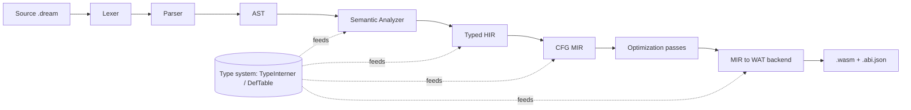
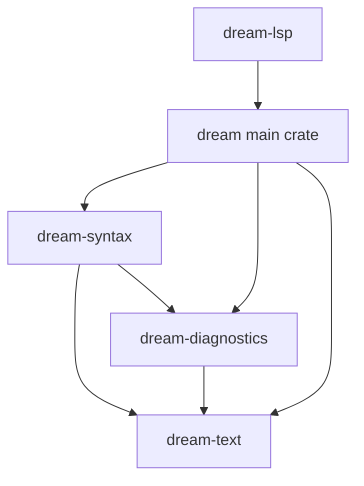

# Dream Compiler — Architecture Guide

This directory is the **engineering handbook** for the Dream compiler's middle and back end. It is
written for someone who has never seen the codebase: by the end you should be able to add a language
feature, write an optimization pass, extend the type system, or wire up a new backend without
guessing.

Read the documents in order the first time. After that, use this page as an index.

| # | Document | What it covers |
|---|----------|----------------|
| — | [README.md](./README.md) (this file) | The big picture, repo layout, crate graph, glossary |
| 01 | [pipeline-overview.md](./01-pipeline-overview.md) | Every compilation stage and the data that flows between them |
| 02 | [type-system.md](./02-type-system.md) | `TypeInterner`, `TypeId`, `TyKind`, `DefId`, compat rules; adding a type |
| 03 | [hir.md](./03-hir.md) | The typed, name-resolved High-level IR |
| 04 | [mir.md](./04-mir.md) | The CFG-based Mid-level IR and how HIR lowers into it |
| 05 | [writing-passes.md](./05-writing-passes.md) | The pass manager and a step-by-step "write your own pass" tutorial |
| 06 | [relooper-and-backend.md](./06-relooper-and-backend.md) | Recovering structured control flow and emitting WAT |
| 07 | [adding-a-language-feature.md](./07-adding-a-language-feature.md) | A full worked example touching every stage |
| 08 | [testing-and-determinism.md](./08-testing-and-determinism.md) | How to test, the determinism contract, conventions |
| 09 | [migration-status.md](./09-migration-status.md) | What is wired, what is not, and the safe order to finish |

---

## Why a multi-pass architecture?

The original Dream backend walked the AST directly and re-derived semantic facts (types, the resolved
callee of a call, ownership) inside code generation. That works for a small language but has three
structural problems:

1. **Re-derivation is fragile and duplicated.** The analyzer already computed types and resolutions;
   codegen recomputed approximations of them (`codegen/wasm/utils/infer.rs`, `resolve.rs`). Two
   sources of truth drift apart.
2. **No place to optimize.** Constant folding, dead-code elimination, inlining, and refcount elision
   need a representation with explicit control/data flow. The AST has neither.
3. **Stringly-typed types.** Types were compared and keyed as strings (`"Box_int"`,
   `"int[]"`, `"int?"`). Equality is a string compare, monomorphization is string mangling, and
   every consumer re-parses suffixes. This is slow, error-prone, and impossible to extend cleanly.

The new design fixes all three by introducing three layered representations and a structured type
system:



Each arrow is a *total* lowering: the producer records everything the consumer needs so the consumer
never reaches backwards. Types are interned once and referenced everywhere by a small integer
(`TypeId`), so equality is `==` and there is no mangling.

---

## Repository layout (compiler-relevant)

```
Dream/
├── crates/                         Front-end crates (layered, enforced by the crate graph)
│   ├── dream-text/                 Source primitives: TextSpan, LineText, IndentedTextWriter
│   ├── dream-diagnostics/          DiagnosticBag, Severity, rendering
│   └── dream-syntax/               Lexer, parser, AST nodes (depends on text + diagnostics)
├── src/
│   ├── types/                      ★ Structured type system (Phase 1)
│   ├── hir/                        ★ Typed High-level IR (Phase 2)
│   ├── mir/                        ★ CFG Mid-level IR, passes, relooper, WAT backend (Phases 3–5)
│   ├── semantics/                  Semantic analyzer + the (currently string-based) tables
│   ├── codegen/                    Legacy AST-walking WASM backend (still the default)
│   ├── driver/                     Pipeline orchestration (compiler.rs), source loading, errors
│   ├── stdlib/                     Prelude + host function registration
│   └── execution/                  (feature "native") wasmtime runner
└── design/compiler/                ← you are here
```

`★` marks the new architecture. It currently lives **alongside** the legacy `codegen/` so the
compiler keeps working while the migration completes; see
[09-migration-status.md](./09-migration-status.md).

### Crate dependency graph



The front-end crates are layered so the dependency direction is enforced by `cargo`, not convention:
`dream-syntax` can never reach into semantics or codegen. The main `dream` crate re-exports them
(`pub use dream_syntax as syntax;`) so historical `crate::syntax::…` paths keep resolving.

---

## The three IRs at a glance

| | AST (`dream-syntax`) | HIR (`src/hir`) | MIR (`src/mir`) |
|---|---|---|---|
| **Shape** | Tree, mirrors source | Tree, type-checked | CFG of basic blocks |
| **Types** | Syntactic (`Type` enum) | `TypeId` on every node | `TypeId` on every local |
| **Names** | Identifiers | Resolved `Binding`/`Callee` | `Local`/`Global` indices |
| **Control flow** | `if`/`while`/`for`/… | Same (structured) | `goto`/`if`/`switch` terminators |
| **Generics** | Type-parameter syntax | Explicit `MonoInstance` worklist | Already monomorphized |
| **RC / alloc** | Implicit | Implicit | Explicit `Retain`/`Release`/`New` |
| **Purpose** | Faithful parse | Kill re-derivation | Optimize + emit |

---

## Glossary

- **Interning / hash-consing** — storing each distinct value once and handing out a small id. The
  `TypeInterner` interns types; identical types share a `TypeId`, so type equality is integer equality.
- **`TypeId`** — an interned type handle (a `u32` newtype). Compare with `==`.
- **`DefId`** — a handle to a *nominal declaration* (a struct/union/enum/function), independent of any
  type arguments. `Box<int>` and `Box<string>` share one `DefId`.
- **Monomorphization** — generating a concrete copy of a generic for each set of type arguments. Keyed
  by `(DefId, Vec<TypeId>)`, never a mangled string.
- **Basic block** — a straight-line run of statements ending in exactly one terminator (the only place
  control can branch).
- **Terminator** — the control-flow instruction that ends a block (`goto`, `if`, `switch`, `return`,
  `unreachable`).
- **Operand** — a readable value: a local/global read or a constant. All computation is an `Rvalue`.
- **Relooper** — the algorithm that turns an arbitrary (reducible) CFG back into structured
  `block`/`loop`/`if` that WASM requires.
- **RC** — reference counting. Heap values (strings, arrays, objects, structs, unions) carry a count;
  `Retain` increments, `Release` decrements and frees at zero.
- **Poison / `Error` type** — the type given to expressions after a semantic error, assignable to and
  from everything so one mistake does not cascade into a flood of diagnostics.

---

## Conventions used in these docs

- File references look like `src/mir/lower.rs` and, where useful, name the function.
- Mermaid diagrams are used for graphs and flows; read them top-to-bottom / left-to-right.
- "Today" describes the code as it currently is; "Target" describes the intended end state when the
  migration in [09](./09-migration-status.md) completes.
