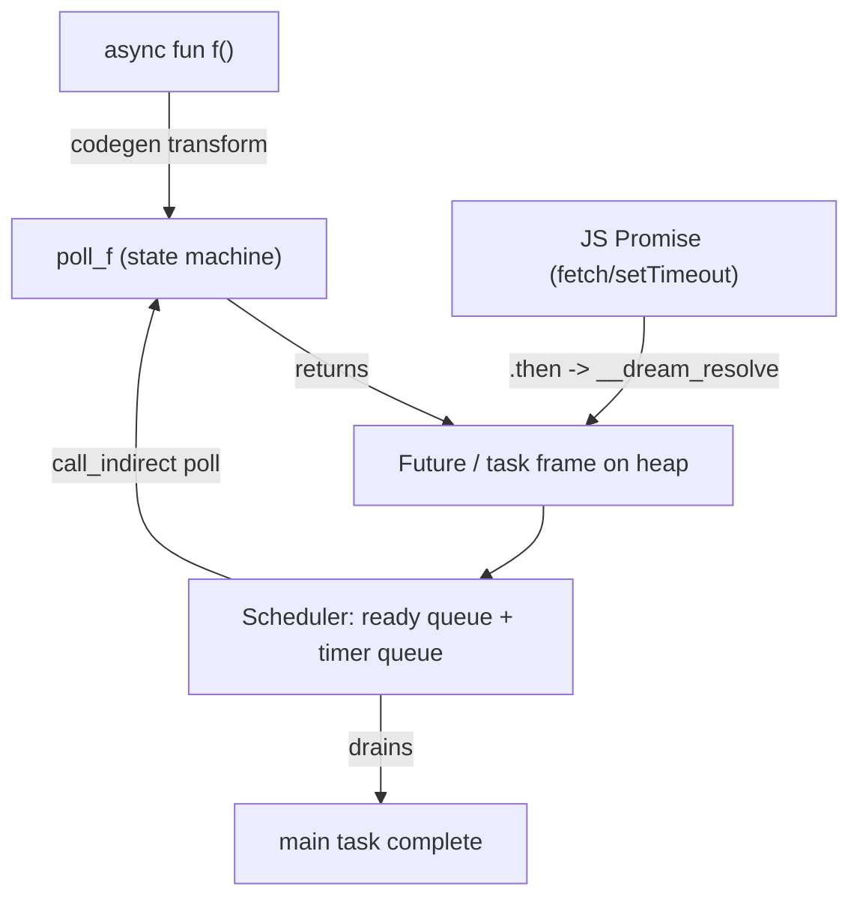

# Async / Await

Dream supports cooperative concurrency with `async`/`await`. The syntax is Python-like, but the execution model is **eager**, like JavaScript: calling an `async fun` starts the work immediately and hands you back a `Future<T>` handle. You retrieve the result with `await`.


## Declaring an async function

Prefix a function with `async`. Its declared return type `T` becomes `Future<T>` at the call site:

```ts
async fun fetchData(): string {
    await sleep(100);   // suspends this task; the event loop keeps running
    return "data";
}
```

## Awaiting

`await e` suspends the current task until the `Future` produced by `e` resolves, then yields its value:

```ts
async fun main(): void {
    let x = await fetchData();   // x : string
    println(x);
}
```

`await f()` is just the call composed with `await`: call `f()` to get a `Future<T>`, then suspend on it to get `T`.

### Where `await` is allowed (v1)

In the current version `await` may only appear at a **top-level statement position**:

```ts
await e;                 // discard the result
let x = await e;         // bind the result
return await e;          // complete with the result
```

Awaiting inside a sub-expression, loop, or branch is a compile-time error in v1:

```ts
let y = await f() + 1;   // error: await must be a top-level statement
```

`await` outside an `async` function is also an error.

## Storing futures (eager execution)

Because calls are eager, you can store the handle and `await` it later. Two calls made before the first `await` run concurrently:

```ts
async fun work(id: int): int {
    await sleep(50);
    return id * id;
}

async fun main(): void {
    let a = work(2);                         // a : Future<int>, started now
    let b = work(3);                         // b : Future<int>, started now
    let results = await Promise.all([a, b]); // both ran concurrently -> [4, 9]
    System.println(to_string(results[0]) + ", " + to_string(results[1]));
}
```

## Combinators (`Promise`)

The combinators are static methods on the built-in `Promise` class, over `Future<T>[]`:

| Method | Signature | Resolves when |
| --- | --- | --- |
| `Promise.all`  | `Promise.all(xs: Future<T>[]): Future<T[]>` | every future has resolved (results in order) |
| `Promise.any`  | `Promise.any(xs: Future<T>[]): Future<T>`   | the first future resolves |
| `Promise.race` | `Promise.race(xs: Future<T>[]): Future<T>`  | the first future settles |

```ts
let first = await Promise.any([work(10), work(20)]);
```

`sleep` stays a top-level function (`sleep(ms: int): Future<void>`); only the combinators moved onto `Promise`.

## Async methods

`async` is not limited to free functions — class methods (instance and `static`) can be `async` too, so a type can own its own asynchronous behavior. An async method call types as `Future<T>` just like a free async call:

```ts
class Downloader {
    url: string;
    async fun fetch(): string {
        let body = await HttpClient("").text(this.url);  // await inside a method body
        return body;
    }
}

async fun main(): void {
    let d = Downloader("https://example.com");
    let body = await d.fetch();   // d.fetch() : Future<string>
    println(body);
}
```

!!! note "v1 restriction"
    Async methods are not allowed on **generic** classes (the `Future<T>` machinery is itself generic). Non-generic classes, including `static async` methods, are fully supported.

## The built-in `sleep`

`sleep(ms: int): Future<void>` is an awaitable timer backed by the runtime's timer queue (a virtual clock natively, `setTimeout` in the browser). It composes with the combinators like any other future.

## How it works

Each `async fun` is compiled to a resumable **state machine** plus a heap **task frame** (the `Future`). A small cooperative **scheduler** — a ready queue plus a timer queue — drives the polls. Calling an `async fun` allocates the `Future` and immediately enqueues its first poll; `await` registers the current task as a waker on the awaited future and suspends until it resolves.



The whole event loop lives **inside** the WebAssembly module, so an `async` program is self-driving and deterministic. An async `main` is exported as an ordinary `() -> ()` entry point that spawns the top-level task and pumps the loop to completion — nothing extra is needed to run it under `wasmtime`.

## Awaiting JavaScript promises

An `extern async fun` bridges to a host function that returns a `Promise`. The `.then` wiring lives entirely in `dream.js`; Dream source never sees a promise:

```ts
@js("api", "getUser")
extern async fun getUser(id: int): string;

async fun main(): void {
    println("fetching...");
    let name = await getUser(42);   // suspends until the JS promise resolves
    println("user = " + name);
}
```

Host side (Node or browser):

```js
import { run } from "./dream.js";

await run("user.wasm", {
  imports: {
    // Returning a Promise is enough — dream.js allocates a host Future,
    // hands its pointer back to Dream, and resolves it when the Promise settles.
    getUser: (id) => fetch(`/api/user/${id}`).then((r) => r.text()),
  },
});
```

The generated `*.abi.json` marks async externs with `"async": true` so the runtime knows to treat the import result as a `Promise`.

A complete runnable example lives in [`sample/interop/async_fetch.dream`](https://github.com/sps014/Dream/blob/main/sample/interop/async_fetch.dream) with its Node runner `async_runner.mjs`.

## Limitations (v1)

- There is no `.then()`/callback chaining and no `spawn`/channels yet.
- References created inside an async function may leak across suspension points (a deliberate v1 simplification).
tion).
