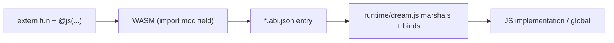

# JS Interop

Dream compiles to WebAssembly, so it runs anywhere WASM does — including the browser and Node. The `extern` keyword lets a Dream program call out to JavaScript with almost no boilerplate, PyScript-style.

## Declaring an extern function

An `extern fun` has a signature but no body. It is lowered to a WebAssembly *import* instead of a defined function:

```ts
extern fun alert(msg: string): void;

fun main(): void {
    alert("Hello from Dream!");
}
```

By default the import comes from the `env` module under the function's own name. You call it like any other function.

## `extern` vs. "JS interop"

There is exactly **one** interop mechanism in Dream, so the distinction is conceptual, not two competing features:

- **`extern fun`** is the *language-side declaration*: a function with a signature but no body. The compiler lowers it to a WebAssembly `(import "module" "field" ...)` and records it in the auto-generated `*.abi.json`.
- **`@js("module", "field")`** is just an *attribute on an `extern`* that remaps the import module/field. Without it, the import defaults to module `env`, field = the function name.
- **The runtime** (`runtime/dream.js`) is the *host-side wiring*: it reads the ABI, marshals values, auto-binds externs to JS globals, and adds a Promise bridge for `extern async fun`.

So `extern` = "this function lives in JS", `@js` = "here's exactly which JS field", and `dream.js` = "here's how values cross the boundary." There is no separate `js`/`eval`/inline-JS path.



## Remapping the import name

Use the `@js(module, name)` attribute to control which import module and field the extern binds to:

```ts
// binds to importObject["dom"]["setText"]
@js("dom", "setText")
extern fun set_text(value: string): void;

// only the module given -> field defaults to the function name
@js("console")
extern fun log(msg: string): void;
```

!!! note "Restrictions"
    Extern functions cannot have a body, cannot be generic, and cannot be combined with `public`.

## Running it from JavaScript

Compiling a `.dream` file automatically produces three artifacts next to it:

- `*.wat` — the human-readable WebAssembly text.
- `*.wasm` — the binary module browsers and Node load.
- `*.abi.json` — an auto-generated description of the extern imports and exports. You never write or edit this; the runtime reads it to marshal values for you.

The `runtime/dream.js` ES module loads the `.wasm`, wires the built-in `print`/math functions, and runs `main`. The `run` helper derives the sibling `.abi.json` automatically, so a whole page can be one call:

```javascript
import { run } from "./runtime/dream.js";

await run("hello.wasm");   // loads hello.abi.json, binds externs, calls main
```

### Auto-binding to JS globals

Most externs need no glue at all. For every extern you do not supply, the runtime resolves it against the JavaScript global scope:

- The default `env` module maps to a bare global — `extern fun alert(...)` binds to `alert`.
- `@js("module", "name")` maps to a property of that global — `@js("console", "log")` binds to `console.log`, `@js("Math", "max")` to `Math.max`.

So built-in browser/Node APIs work with zero boilerplate. You only pass `imports` for your own custom logic:

```javascript
await run("hello.wasm", {
  imports: {
    square: (n) => n * n,   // keyed by the Dream function name
  },
});
```

If an extern matches no global and you do not provide it, the runtime installs a stub that throws only if it is actually called — so the module still instantiates.

When you need full control, use `load(source, options)` instead of `run`; it returns the instance without calling `main`.

## Value marshaling

With the ABI loaded, arguments and return values are converted between Dream's heap layout and JavaScript:

| Dream type | JavaScript value (as argument) | As return value |
|--------------|-------------------------------|-----------------|
| `int`, `float`, `double` | `number` | `number` |
| `bool` | `boolean` | `boolean` |
| `string` | `string` (decoded UTF-8) | return a `string` |
| `T[]` | `Array` of marshaled elements | (pointer) |
| `object`, classes, `List<T>` | opaque pointer (`number`) | (pointer) |

For reference types you can read the underlying data with the instance helpers:

```javascript
mod.readString(ptr);          // null-terminated UTF-8 string
mod.readArray(ptr, "int");    // -> number[]
mod.readList(ptr, "string");  // List<string> -> string[]
mod.readStruct(ptr, [         // class by field schema (declaration order)
  { name: "x", type: "int" },
  { name: "y", type: "int" },
]);
```

To hand a string back to Dream from a JS implementation, the runtime calls the exported `malloc` for you (or you can call `mod.writeString(str)` directly).

## JavaScript object references

A real JavaScript object (a `RegExp`, a fetch `Response`, a DOM node, ...) can now cross into Dream as an opaque [`JsRef`](references.md) handle, instead of being flattened to a string. See **[References](references.md)** for the full `JsRef` API.

## Callbacks

Functions cross the boundary in both directions — pass a Dream `fun(...)` to JavaScript, or hand a JS function into a Dream `extern` parameter. See **[Callbacks](callbacks.md)**.

## Built on interop

Three standard-library features are pure interop wrappers built on the pieces above, so they are good worked examples:

- **[JSON](json.md)** — native parse/stringify plus `@json` auto-derive (no interop needed, but pairs with HTTP).
- **[Regex](regex.md)** — JavaScript `RegExp` exposed through the `Regex` class.
- **[HttpClient](../stdlib/http.md)** — an instantiable, cross-runtime HTTP client over `extern async fun`.
