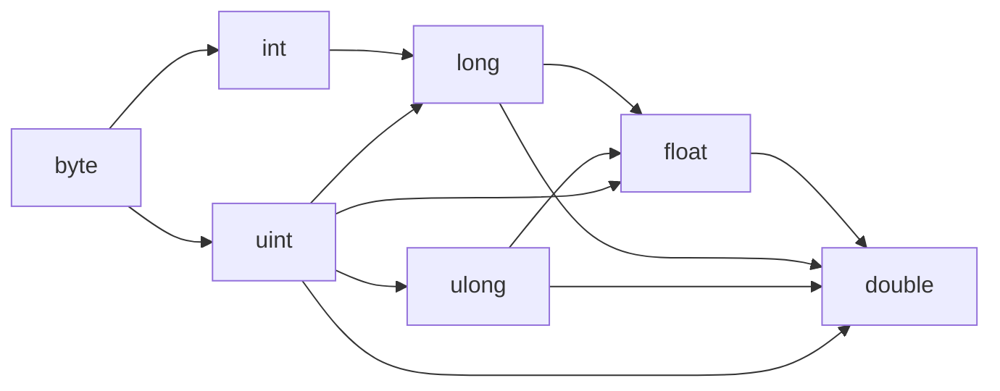

# Types

## Primitives

| Type     | Description                        | Example literal  |
|----------|------------------------------------|-----------------|
| `int`    | 32-bit signed integer              | `42`, `-7`       |
| `uint`   | 32-bit unsigned integer            | `42u`, `42U`     |
| `long`   | 64-bit signed integer              | `42L`            |
| `ulong`  | 64-bit unsigned integer            | `42uL`, `42UL`, `42Lu` |
| `byte`   | 8-bit unsigned integer (0–255)     | `255b`, `255B`   |
| `float`  | 32-bit floating point              | `3.14f`, `1.0`   |
| `double` | 64-bit floating point              | `3.14d`, `1.0d`  |
| `bool`   | Boolean (`true` or `false`)        | `true`           |
| `char`   | A single character (code point)    | `'A'`, `'\n'`    |
| `string` | UTF-8 text, heap allocated         | `"hello"`, `$"hi {name}"` |
| `void`   | No value — only valid as a return type | —            |

### Integer literal suffixes

A plain integer literal is an `int` and a literal with a decimal point is a `float`. A suffix
(case-insensitive) selects one of the other numeric types:

| Suffix        | Type    | Example          |
|---------------|---------|------------------|
| `L`           | `long`  | `9000000000L`    |
| `u` / `U`     | `uint`  | `4000000000u`    |
| `uL` / `UL` / `Lu` | `ulong` | `18000000000uL` |
| `b` / `B`     | `byte`  | `255b`           |
| `f` / `F`     | `float` | `3.14f`          |
| `d` / `D`     | `double`| `3.0d`           |

`byte`, `uint`, and `ulong` are **unsigned**: division, remainder, comparisons, and right shift
use unsigned semantics. `int` and `long` are signed. `byte` and `char` each occupy a single byte
in memory; `long`/`ulong`/`double` occupy 8 bytes; `int`/`uint`/`float` occupy 4.

### Implicit widening

A narrower numeric value is promoted to a wider numeric type automatically (no cast). Narrowing,
and converting between same-width types of different signedness (`int`↔`uint`, `long`↔`ulong`),
always requires an explicit cast.



```dream
let a: long = 5;          // int -> long
let b: ulong = 7u;        // uint -> ulong
let d: double = 9000000000L;  // long -> double
let n: int = (int)d;      // narrowing: cast required
```

## Arrays

Append `[]` to any type to get an array of that type:

```dream
let nums: int[] = [10, 20, 30];
let names: string[] = ["a", "b", "c"];
```

Array access is zero-indexed:

```dream
let first = nums[0];   // 10
nums[1] = 99;
```

Arrays are fixed-size once created from a literal. For a growable list, use [`List<T>`](../stdlib/list.md).

## Nullable types

Any reference type can be marked nullable with `?`. A nullable variable may hold either a real value or `null`:

```dream
let node: Node? = null;
node = Node(5, null);
```

Primitive types (`int`, `uint`, `long`, `ulong`, `byte`, `float`, `double`, `bool`, `char`) cannot be nullable.

The null-coalescing operator `??` provides a fallback for nullable values (see [operators](operators.md)).

## char

`char` is a dedicated single-character type. A character literal is written in single quotes, and common escapes (`'\n'`, `'\t'`, `'\r'`, `'\0'`, `'\\'`, `'\''`) are supported. Each `char` occupies one byte in memory (in arrays and class fields), making `char[]` a compact byte/character buffer:

```dream
let a: char = 'A';
let newline: char = '\n';
print(a);                  // prints "A"

let letters: char[] = ['h', 'i'];
print(letters[0]);         // prints "h"
```

A `char` and an `int` convert losslessly via a cast (a `char` is a code point):

```dream
let code: int = (int)a;       // 65
let next: char = (char)(code + 1);  // 'B'
```

## byte and byte[]

`byte` is the canonical element type for raw binary data. A `byte[]` is a compact, one-byte-per-element buffer used throughout the standard library for binary I/O (e.g. [`File.read_bytes`/`write_bytes`](../stdlib/file.md) and `HttpResponse.bytes()`):

```dream
let data: byte[] = [72b, 105b, 33b];
let w = await File.write_bytes("out.bin", data);   // Result<long, string>
let back = await File.read_bytes("out.bin");        // Result<byte[], string>
```

A `byte` and a `char` convert via a cast, which is handy when materializing text from a byte buffer:

```dream
let ch: char = (char)data[0];   // 'H'
let b2: byte = (byte)ch;        // back to 72
```

## Enums

A set of named integer constants, or — when a variant carries a payload — a discriminated union.
See [Enums](enums.md) and [Discriminated Unions](discriminated-unions.md).

## Type aliases

`type` introduces an alias for an existing type. Aliases are resolved at compile time (they are interchangeable with the underlying type) and must be declared before use:

```dream
type Number = int;
type Names = string[];

fun add(a: Number, b: Number): Number {
    return a + b;
}
```

## Classes

User-defined types. See [Classes](classes.md).

## The `object` type

A universal container that can hold any value at runtime. Useful for heterogeneous collections and runtime type dispatch. See [The object type](objects.md).

## Type casting

Use a C-style cast to convert between numeric types or between a value and `object`:

```dream
let n = 7;
let f = (float)n;        // int -> float
let back = (int)f;       // float -> int

let o: object = n;       // boxing — int stored as object
let unboxed = (int)o;    // unboxing — traps if wrong type at runtime
```

Supported conversions: any numeric type ↔ any numeric type (`int`, `uint`, `long`, `ulong`, `byte`, `float`, `double`), `char ↔ int`, `char ↔ byte`, and any type ↔ `object`. Widening conversions are implicit; narrowing (and same-width sign changes) require an explicit cast. Casting into `byte` keeps only the low 8 bits.
