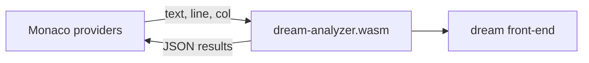

# Dream tooling

Browser-based language tooling for Dream. The compiler's front-end (lexer, parser, semantic
analyzer) is compiled to WebAssembly and wired into a [Monaco](https://microsoft.github.io/monaco-editor/)
editor, giving a playground with live language features.

## Layout

- [`dream-analyzer/`](dream-analyzer) — a Rust `cdylib` that reuses the `dream` crate's
  front-end and exposes a language service to JavaScript via `wasm-bindgen`. It runs entirely
  in the browser; no server is involved.
- [`web/`](web) — a Vite + TypeScript app embedding Monaco and binding the WASM service to
  Monaco's provider APIs.

## Features

- Live diagnostics (lexer/parser/semantic errors and warnings)
- Syntax highlighting (Monarch grammar) and semantic tokens
- Hover (function/class/enum/variable signatures and types)
- Autocomplete (keywords, in-scope symbols, class members, enum members)
- Go to definition and find all references
- Document formatting (brace-depth reindentation)

## Prerequisites

- A Rust toolchain with the `wasm32-unknown-unknown` target:
  ```bash
  rustup target add wasm32-unknown-unknown
  ```
- [`wasm-pack`](https://rustwasm.github.io/wasm-pack/):
  ```bash
  curl https://rustwasm.github.io/wasm-pack/installer/init.sh -sSf | sh
  ```
- Node.js 18+ and npm.

## Build and run

The quickest way is the `start` script, which installs deps (first run only), builds the
WebAssembly analyzer, and launches the dev server. It works from any directory:

```bash
./tooling/start
```

Or do it manually from this `tooling/` directory:

```bash
# 1. Build the WebAssembly language service into web/src/pkg
cd web
npm install
npm run build:wasm

# 2. Start the dev server
npm run dev
```

Then open the printed URL (default <http://localhost:5173>).

`npm run build:wasm` is a thin wrapper around:

```bash
wasm-pack build ../dream-analyzer --target web --out-dir ../web/src/pkg --out-name dream_analyzer
```

The generated `web/src/pkg/` directory is a build artifact (git-ignored); rerun
`npm run build:wasm` whenever the Rust analyzer changes.

To produce a static production bundle:

```bash
npm run build      # outputs to web/dist
npm run preview    # serves the built bundle
```

## How it works

The `dream` crate is built with `default-features = false`, which drops the native
`wasmtime`-backed runtime (gated behind the `native` feature) so only the WASM-friendly
front-end is compiled. `dream-analyzer` adds an in-memory analysis entry point — lex, parse,
merge the embedded standard-library prelude, then analyze — and a span-indexed symbol model
that powers navigation. Byte spans from the compiler are converted to LSP/Monaco positions
(0-based lines, UTF-16 columns) before crossing into JavaScript.



## Tests

The analyzer's exports are plain Rust functions on the host target, so they can be tested
without a browser:

```bash
cargo test -p dream-analyzer
```
